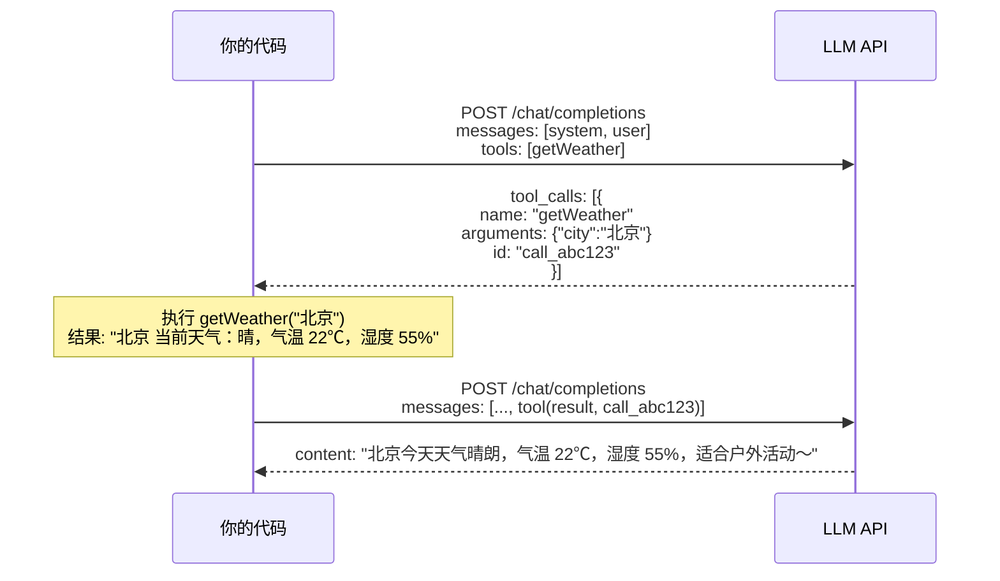

# Day 0：起步 —— 理解 Agent Harness 与环境准备

## 这个教程要做什么

用七天时间，从零手写一个轻量但完整的 **Agent Harness 框架**，语言是 Go。

最终产出是一个约 1000 行的可运行框架，它能做到这些事：

- 接收用户的自然语言指令
- 自主决定调用什么工具（读文件、执行命令、写文件）
- 根据工具返回的结果继续思考，必要时多轮调用
- 支持通过 Skill 动态扩展能力
- 支持通过 MCP 协议对接外部工具服务
- 对话过长时自动压缩历史，保持上下文窗口可控

举个例子，当你对这个 Agent 说"帮我看看 main.go 有没有 bug，如果有就修复"，它会：

```
[思考] 需要先读取 main.go 的内容
[工具调用] file_read("main.go")
[观察] 发现第 23 行有一个未处理的 error
[思考] 我来修复这个问题，然后跑一下测试验证
[工具调用] file_write("main.go", 修复后的内容)
[工具调用] bash("go test ./...")
[观察] 测试全部通过
[回复] 已修复 main.go 第 23 行的 error 处理问题，测试通过。
```

这就是一个典型的 Agent Loop —— **思考 → 行动 → 观察** 的循环，也就是所谓的ReAct模式，直到任务完成。

## 什么是 Harness

在 Agent 领域有一个被广泛认可的公式：

```
Agent = Model + Harness
```

**Model** 是大语言模型本身（GPT、Claude、DeepSeek 等），负责推理和生成。

**Harness** 是模型之外的一切：系统提示词、工具定义与执行、消息管理、技能模块、子代理编排、安全边界。它是包裹在模型周围的完整运行时基础设施。

一个形象的类比：模型是发动机，Harness 是整辆车的底盘、方向盘、刹车和导航系统。发动机再强，没有底盘也只能原地轰鸣。

Harness 的核心职责包括：

- **System Prompt 构建**：告诉模型它是谁、能做什么、有哪些约束
- **工具注册与调度**：定义模型可以调用哪些工具，调用时怎么执行
- **消息管理**：维护对话历史，在上下文窗口有限的情况下做压缩和裁剪
- **技能扩展**：动态加载新能力，不需要改框架代码
- **安全与控制**：超时、最大轮次、权限边界

这个教程要手写的，就是这整套 Harness。

:::tip 这么多新名词，如何学的过来？

其实从我个人看来，不断涌向的新名词更多的是一种推广和营销的手段，其实本质上可能一直都没变过，只不过有了新的解决方案后，需要一个新名词来
进行区分和推广而已。
:::

## 为什么从零写，不用框架

Go 生态已经有 Eino（字节）、tRPC-Agent-Go（腾讯）、Google ADK-Go 这些框架了。为什么不直接用？

原因很简单：**框架帮你隐藏了复杂度，但 Agent 的核心竞争力恰恰在 Harness 层的调优**。

类比 Web 开发：你可以用 Gin 写 HTTP 服务，但当你遇到性能瓶颈、诡异的中间件顺序问题、需要自定义协议时，只有理解 `net/http` 底层的人才能解决。Agent 开发也是一样——当你的 Agent 表现不好时，问题几乎总是出在 Harness 层：prompt 写得不对、工具描述不清晰、上下文被截断丢了关键信息、消息格式有问题。

从零写一遍，你就能：

- 精确理解 Agent Loop 的每一步在做什么
- 遇到问题时知道该去哪里排查
- 有能力针对特定场景做深度定制
- 面试时说"我手写过 Agent 框架"而不是"我调过 LangChain"

写完这个教程后，你再去看 Eino 或任何框架的源码，会发现一切都是似曾相识的。

## 为什么用 Go

不是"为了用 Go 而用 Go"。Go 在 Agent 框架开发中有几个天然优势：

**interface 做工具抽象**。Go 的 interface 是隐式实现的，定义一个 `Tool` interface 后，任何实现了对应方法的 struct 自动满足接口。新增一个工具不需要继承、不需要注册装饰器，写一个 struct 就行。

**context.Context 控制生命周期**。Agent Loop 中到处需要超时和取消：LLM 调用可能很慢、bash 命令可能卡死、MCP server 可能无响应。Go 的 context 机制天然贯穿整个调用链，一行 `ctx, cancel := context.WithTimeout(...)` 就能优雅处理。

**goroutine + channel 处理并发通信**。MCP 客户端需要同时读写子进程的 stdin/stdout，用 goroutine 拆分读写协程、用 channel 同步结果，代码比 Python 的 asyncio 直观得多。

**编译为单二进制**。框架写完后 `go build` 一下就是一个可执行文件，不依赖运行时环境，拿到任何机器上都能直接跑。

**error 作为值**。工具执行可能失败，Go 的 error handling 让你在每一步都显式处理失败情况，把错误信息友好地返回给 LLM，而不是一个未捕获的异常炸掉整个循环。


:::info
其实也很简单，Java不太适合作为终端应用，我不太会TS和Python，Go语言既有不错的开发效率，语法特性也比较适合。
:::

## 核心概念速览

在开始写代码之前，先建立一个全局认知。这个框架涉及的核心概念只有这几个：

### Agent Loop（事件循环）

Agent 的运行本质上是一个 for 循环：

```go
for {
    response := callLLM(messages)
    if response 包含工具调用 {
        // 执行工具
        result := execTool(response.tool_call)

        // 把工具执行的结果交给 LLM 继续思考
        messages = append(messages, result)
        continue  
    }
    // 没有工具调用，模型给出了最终回答
    fmt.Println(response.content)
    break
}
```

就这么简单。所有复杂的 Agent 行为——多步推理、错误重试、自我纠正——都是这个循环自然涌现的结果。

### Tool Calling（工具调用）

现代 LLM（GPT、Claude、DeepSeek）都支持 Function Calling / Tool Calling。你在调用 API 时传入一组工具的定义（名称、描述、参数 JSON Schema），模型在需要时会返回一个结构化的工具调用请求，而不是纯文本回答。

你的框架负责：拿到这个请求 → 找到对应的工具 → 执行 → 把结果放回消息列表 → 再次调用 LLM。

下面用 `getWeather` 为例，具体看看整个交互过程。

**第一步：定义工具**

你告诉模型："你可以用 `getWeather` 这个函数查询天气，它需要一个 `city` 参数"，对应的Go SDK的定义如下：
```go
tools := []openai.ChatCompletionToolParam{
    {
        Function: openai.FunctionDefinitionParam{
            Name:        "getWeather",
            Description: openai.String("查询指定城市的当前天气"),
            Parameters: openai.FunctionParameters{
                "type": "object",
                "properties": map[string]any{
                    "city": map[string]any{
                        "type":        "string",
                        "description": "要查询天气的城市名，例如：北京、上海",
                    },
                },
                "required": []string{"city"},
            },
        },
    },
}
```

这段代码会被 SDK 序列化为以下 JSON 随请求一起发给模型：

:::tip

无论使用哪一种语言，哪一家的模型，只要是兼容OpenAI Chat API的，都是下面的格式,包括MCP的调用，基本也是一致的格式
:::


```json
{
  "tools": [{
    "type": "function",
    "function": {
      "name": "getWeather",
      "description": "查询指定城市的当前天气",
      "parameters": {
        "type": "object",
        "properties": {
          "city": {
            "type": "string",
            "description": "要查询天气的城市名，例如：北京、上海"
          }
        },
        "required": ["city"]
      }
    }
  }]
}
```

**第二步：模型决策**

当用户问"北京今天天气怎么样？"，模型收到消息和工具定义后，它知道自己不知道天气，但看到了 `getWeather` 工具。于是它**不生成自然语言回答**，而是返回一个工具调用指令（部分结构）：

:::tip
实际就是返回一个工具调用的信息，告诉客户端，需要调用这个工具获取真实的结果，之后再作出处理
:::

```json
{
  "role": "assistant",
  "content": null,
  "tool_calls": [{
    "id": "call_abc123",
    "type": "function",
    "function": {
      "name": "getWeather",
      "arguments": "{\"city\": \"北京\"}"
    }
  }]
}
```

完整的API返回格式如下
```json{26-35}
{
  "id": "63c18dff-154c-49cc-8c35-e2fef470c2cd",
  "choices": [
    {
      "finish_reason": "tool_calls",
      "index": 0,
      "logprobs": {
        "content": null,
        "refusal": null
      },
      "message": {
        "content": "好的，我来帮你查一下北京今天的天气！",
        "refusal": "",
        "role": "assistant",
        "annotations": null,
        "audio": {
          "id": "",
          "data": "",
          "expires_at": 0,
          "transcript": ""
        },
        "function_call": {
          "arguments": "",
          "name": ""
        },
        "tool_calls": [ // [!code highlight]
          { // [!code highlight]
            "id": "call_00_tAXgHjzPvOI7Q1cjOzqf6169",
            "function": {
              "arguments": "{\"city\": \"北京\"}",
              "name": "getWeather"
            },
            "type": "function"
          }
        ]
      }
    }
  ],
  "created": 1782305190,
  "model": "deepseek-v4-flash",
  "object": "chat.completion",
  "service_tier": "",
  "system_fingerprint": "fp_8b330d02d0_prod0820_fp8_kvcache_20260402",
  "usage": {
    "completion_tokens": 68,
    "prompt_tokens": 306,
    "total_tokens": 374,
    "completion_tokens_details": {
      "accepted_prediction_tokens": 0,
      "audio_tokens": 0,
      "reasoning_tokens": 15,
      "rejected_prediction_tokens": 0
    },
    "prompt_tokens_details": {
      "audio_tokens": 0,
      "cached_tokens": 256
    }
  }
}
```

关键字段解读：

| 字段 | 谁产生的 | 含义 |
|------|---------|------|
| `name` | 模型 | 模型选择了哪个工具 |
| `arguments` | 模型 | 模型根据工具定义的 JSON Schema 生成的参数，是一个 JSON 字符串 |
| `id` | 模型 | 调用的唯一标识，回传结果时必须原样带回 |

**第三步：你的代码执行工具**

拿到 `tool_calls` 后，你的代码负责真正执行函数：

```go
msg := resp.Choices[0].Message

for _, call := range msg.ToolCalls {
    // 解析参数
    var args map[string]any

    // 将参数反序列化为Json格式的
    json.Unmarshal([]byte(call.Function.Arguments), &args)

    // 获取city参数
    city := args["city"].(string)

    // 直接调用getWeather的具体实现
    result := getWeather(city) 

    // 把工具的结果构造成 tool 消息
    messages = append(messages, openai.ToolMessage(result, call.ID))
}
```

> 因为工具执行的结果是在我们本地，或者说在客户端，服务端的大模型是不知道的，所以，还需要一次调用，将工具调用的结果，追加到 `message` 数组中。

`openai.ToolMessage(result, call.ID)` 生成的 JSON：

```json
{
  "role": "tool",
  "content": "北京 当前天气：晴，气温 22℃，湿度 55%",
  "tool_call_id": "call_abc123"
}
```

完整的请求结构如下：
```json
{
  "messages": [
    {
      "content": "你是一个简洁友好的助手，必要时可以调用工具来获取信息。",
      "role": "system"
    },
    {
      "content": "北京今天天气怎么样？",
      "role": "user"
    },
    {
      "content": "好的，我来帮你查一下北京今天的天气！",
      "tool_calls": [
        {
          "id": "call_00_tAXgHjzPvOI7Q1cjOzqf6169",
          "function": {
            "arguments": "{\"city\": \"北京\"}",
            "name": "getWeather"
          },
          "type": "function"
        }
      ],
      "role": "assistant"
    },
    {
      "content": "北京 当前天气：多云，气温 32℃，湿度 73%",
      "tool_call_id": "call_00_tAXgHjzPvOI7Q1cjOzqf6169",
      "role": "tool"
    }
  ],
  "model": "deepseek-v4-flash",
  "tools": [
    {
      "function": {
        "name": "getWeather",
        "description": "查询指定城市的当前天气",
        "parameters": {
          "properties": {
            "city": {
              "description": "要查询天气的城市名，例如：北京、上海",
              "type": "string"
            }
          },
          "required": [
            "city"
          ],
          "type": "object"
        }
      },
      "type": "function"
    }
  ]
}
```

**第四步：模型基于结果回答**

你把 tool 消息追加到 messages 末尾后再次调用 LLM，此时对话历史变为：

```
[system]     你是一个简洁友好的助手...
[user]       北京今天天气怎么样？
[assistant]  tool_calls: getWeather("北京")
[tool]       北京 当前天气：晴，气温 22℃，湿度 55%
```

对应的完整 messages 数组 JSON：

```json
{
  "messages": [
    {
      "role": "system",
      "content": "你是一个简洁友好的助手，可以查询天气信息。"
    },
    {
      "role": "user",
      "content": "北京今天天气怎么样？"
    },
    {
      "role": "assistant",
      "content": null,
      "tool_calls": [
        {
          "id": "call_abc123",
          "type": "function",
          "function": {
            "name": "getWeather",
            "arguments": "{\"city\": \"北京\"}"
          }
        }
      ]
    },
    {
      "role": "tool",
      "content": "北京 当前天气：晴，气温 22℃，湿度 55%",
      "tool_call_id": "call_abc123"
    }
  ]
}
```

模型看到工具结果后，生成最终的自然语言回答：

> 北京今天天气晴朗，气温 22℃，湿度 55%，适合户外活动～

**完整交互序列图**



这就是 Tool Calling 的完整闭环。几个重要的认知：

- **模型不执行任何代码**，它只是输出一个 JSON 告诉你"我建议调用这个函数，参数是这个"
- **你的代码是模型的"手脚"**，真正执行函数、访问文件系统、调用外部 API 的都是你
- **工具定义是模型的"使用说明书"**，描述写得越清晰，模型越知道什么时候该调用、怎么传参数
- **`tool_call_id` 是关联键**，模型可能同时请求多个工具，靠 id 把每个请求和结果配对

### System Prompt（系统提示词）

System Prompt 是 Agent 的"灵魂设定"。它告诉模型：你是谁、你能做什么、有哪些规则要遵守、当前有哪些工具可用。一个好的 Harness 会动态组装 System Prompt——根据加载的 Skill、注册的工具、用户的偏好来拼接。

### Skill（技能模块）

Skill 是一种可插拔的能力单元。每个 Skill 是一个目录，包含一个描述文件（说明这个技能做什么、什么时候触发）和可选的额外工具。加载一个 Skill，就是把它的描述注入 System Prompt、把它的工具注册到工具表。

### MCP（Model Context Protocol）

MCP 是 Anthropic 提出的一个标准协议，用于让 Agent 通过统一的方式对接外部工具服务。简单理解：你的框架启动一个 MCP Server 子进程，通过 stdin/stdout 用 JSON-RPC 通信，获取它提供的工具列表并调用。这样任何符合 MCP 协议的服务都能即插即用。

### 对话压缩

LLM 的上下文窗口是有限的（4K、8K、128K tokens 不等）。当对话越来越长，你需要一种策略来压缩历史：保留最近的对话、把旧的历史压缩成摘要。这个"管理上下文窗口"的工作，也是 Harness 的职责。

## 环境准备

### 前置要求

- **Go 1.22+**（使用了部分新版本特性）
- **一个 OpenAI 兼容的 API**（以下任选其一）：
  - OpenAI 官方 API（需要 key）
  - DeepSeek API（国内可直接访问，价格便宜）
  - 本地 Ollama（完全免费，但需要较好的显卡）
- **一个趁手的编辑器**（VS Code + Go 插件 / GoLand / Vim 都行）

### 初始化项目

```bash
mkdir agent-harness && cd agent-harness
go mod init github.com/yourname/agent-harness
```

### 创建目录结构

```bash
mkdir -p cmd/agent
mkdir -p internal/{loop,llm,tool,skill,mcp,context}
mkdir -p skills/example
```

此时项目结构如下：

```
agent-harness/
├── cmd/
│   └── agent/          # 程序入口
├── internal/
│   ├── loop/           # Day 1: Agent Loop
│   ├── llm/            # Day 1: LLM 客户端
│   ├── tool/           # Day 2: 工具系统
│   ├── skill/          # Day 4: Skill 加载
│   ├── mcp/            # Day 5: MCP 客户端
│   └── context/        # Day 6: 消息管理
├── skills/             # Skill 存放目录
│   └── example/
├── go.mod
└── go.sum
```

### 验证环境：第一次调用 LLM

在正式开始之前，我们先写一个最小的程序验证 API 可用。

首先安装 openai-go SDK：

```bash
go get github.com/openai/openai-go
```

然后创建 `cmd/agent/main.go`：

```go
package main

import (
	"context"
	"fmt"
	"os"

	"github.com/openai/openai-go"
	"github.com/openai/openai-go/option"
)

func main() {
	apiKey := os.Getenv("LLM_API_KEY")
	baseURL := os.Getenv("LLM_BASE_URL") // 例如 https://api.deepseek.com/v1
	if apiKey == "" || baseURL == "" {
		fmt.Println("请设置环境变量 LLM_API_KEY 和 LLM_BASE_URL")
		os.Exit(1)
	}

	// 创建 OpenAI 客户端，通过 WithBaseURL 支持任意 OpenAI 兼容 API
	client := openai.NewClient(
		option.WithAPIKey(apiKey),
		option.WithBaseURL(baseURL),
	)

	ctx := context.Background()

	// 发起一次最简单的 Chat Completion 请求
	chatCompletion, err := client.Chat.Completions.New(ctx, openai.ChatCompletionNewParams{
		Messages: []openai.ChatCompletionMessageParamUnion{
			openai.UserMessage("用一句话解释什么是 Agent Loop"),
		},
		Model: openai.ChatModelGPT4oMini, // 根据你的 API 替换模型名
	})
	if err != nil {
		fmt.Printf("请求失败: %v\n", err)
		os.Exit(1)
	}

	// 提取模型回复
	if len(chatCompletion.Choices) > 0 && chatCompletion.Choices[0].Message.Content != "" {
		fmt.Println("✓ LLM 连通成功！")
		fmt.Println()
		fmt.Println("回答:", chatCompletion.Choices[0].Message.Content)
	}
}
```

代码说明：

- `openai.NewClient` 创建客户端，`WithBaseURL` 让它支持任意 OpenAI 兼容 API（DeepSeek、Ollama 等）
- `openai.UserMessage` 是 SDK 提供的快捷构造方法，等价于手动构造 `{role: "user", content: "..."}`
- `openai.ChatModelGPT4oMini` 是 SDK 内置的模型常量，你也可以直接传字符串如 `"deepseek-chat"`
- `chatCompletion.Choices[0].Message.Content` 是类型安全的字段访问，比手写 JSON 解析更可靠

运行验证：

```bash
export LLM_API_KEY="your-api-key"
export LLM_BASE_URL="https://api.deepseek.com/v1"  # 或你用的服务地址

go run cmd/agent/main.go
```

如果看到类似输出，说明环境 OK：

```
✓ LLM 连通成功！

回答: Agent Loop 是一个循环过程，AI 不断地思考、调用工具、观察结果，直到完成任务。
```

这段代码 Day 1 会被重构为正式的 LLM Client，现在只是验证连通性。

## 教程节奏

| 天数 | 主题 | 你将实现什么 |
|------|------|------------|
| **Day 0** | 起步（本篇） | 理解概念、搭建环境、验证 API |
| **Day 1** | Agent Loop | 一个能跑通 tool_call 循环的最小 Agent |
| **Day 2** | 内置工具与注册表 | bash / file_read / file_write + ToolRegistry |
| **Day 3** | System Prompt 工程 | 动态 prompt 组装、模板化、上下文注入 |
| **Day 4** | Skill 注册与加载 | Skill 规范定义、目录扫描、热加载 |
| **Day 5** | MCP 客户端 | stdio transport、JSON-RPC 通信、工具桥接 |
| **Day 6** | 消息管理与对话压缩 | token 计数、滑动窗口、摘要压缩 |
| **Day 7** | 整合与 CLI 交互 | 配置化、REPL 交互、日志输出、端到端演示 |

每天的节奏是：概念讲解（10 分钟能读完）→ 核心代码实现（100-200 行）→ 设计决策讨论（为什么这样做）→ 运行验证。

代码会逐天累积。Day 1 的代码在 Day 2 会被 import 复用，Day 7 把所有模块组装到一起。每天结束时你都有一个可运行的阶段性成果。

## 下一步

环境准备好了，概念也有了全局认知。明天（Day 1）我们开始写真正的 Agent Loop——这是整个框架的心脏，大约 80 行 Go 代码就能让一个 Agent "转"起来。
