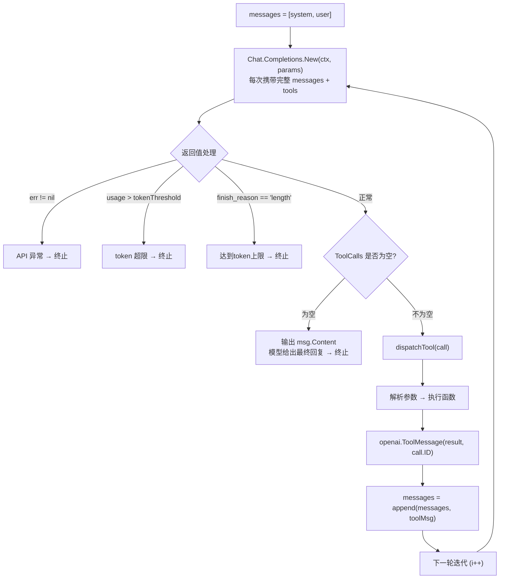

# Day 1：Agent Loop

## 导语
前一天，我们基本理解如何和大模型进行多轮的交互，以实现更复杂的功能，今天就继续来完善，实现一个基本的Agent Loop，同样的，还是"查询天气为示例"。
## 本日目标

从零实现一个完整的 Agent Loop：包含工具定义、LLM 调用、工具执行、结果回传、以及多重终止条件。最终产出一个约 150 行的可运行 Agent。

## 你将学到
- 掌握模型返回的 tool_calls 交互机制，提取函数名和参数
- 工具分发与执行，结果构造为 tool message 回传
- 掌握Agent循环中的自主多轮推理过程
- Agent循环中四种基本终止条件：maxIterations（安全上限）、无工具调用（正常结束）、API 异常（接口报错 / finish_reason 异常）、token 用量超阈值

## 整体结构概览

在深入代码之前，先理解今天要构建的程序结构：

```
main()
├── 初始化：client、messages、tools   //初始化大模型调用客户端、系统提示词、工具定义
└── runAgentLoop(client, messages, tools)
    ├── for i := 1; i <= maxIterations; i++
    │   ├── 调用 LLM (Chat.Completions.New)
    │   ├── 检查 API 错误 → 终止
    │   ├── 检查 token 用量 → 超阈值? 终止
    │   ├── 检查 finish_reason → "length"? 终止
    │   ├── 检查 ToolCalls → 为空? 输出最终回复，结束
    │   └── 遍历 ToolCalls → dispatchTool → 结果回填 messages
    └── 达到 maxIterations → 终止
```

五个关键函数/常量：

| 名称 | 职责 |
|------|------|
| `maxIterations` | 最大迭代次数，防止无限循环 |
| `tokenThreshold` | token 用量警戒线，防上下文爆炸 |
| `runAgentLoop` | 主循环，四种终止条件 + 工具执行 |
| `dispatchTool` | 根据工具名路由到具体实现 |

下面逐个击破。

## 第一步：初始化——客户端、消息、工具

```go
// 分别从环境变量中读取调用大模型的API路径和鉴权Token
apiKey := os.Getenv("LLM_API_KEY")
baseURL := os.Getenv("LLM_BASE_URL")

client := openai.NewClient(
    option.WithAPIKey(apiKey),
    option.WithBaseURL(baseURL),
)

// 拼接message数组
messages := []openai.ChatCompletionMessageParamUnion{
    // 通过SDK方法，定义系统提示词
    openai.SystemMessage("你是一个简洁友好的助手，必要时可以调用工具来获取信息。"),
    // 通过SDK方法，输入用户输入
    openai.UserMessage("给我明天北京的穿衣指南"),
}

// 定义 getWeather 天气查询的Function/Tool 的名称、参数等信息
tools := []openai.ChatCompletionToolParam{
    {
        Function: openai.FunctionDefinitionParam{
            Name:        "getWeather",
            Description: openai.String("查询指定城市的当前天气"),
            Parameters: openai.FunctionParameters{
                "type": "object",
                "properties": map[string]any{
                    "city": map[string]any{
                        "type":        "string",
                        "description": "要查询天气的城市名，例如：北京、上海",
                    },
                },
                "required": []string{"city"},
            },
        },
    },
}
```

经过组装之后，请求大模型的请求体如下：

```json{1-10,12-32}
{
  "messages": [
    {
      "content": "你是一个简洁友好的助手，必要时可以调用工具来获取信息。",
      "role": "system"
    },
    {
      "content": "给我明天北京的穿衣指南",
      "role": "user"
    }
  ],
  "model": "deepseek-v4-flash",
  "tools": [
    {
      "function": {
        "name": "getWeather",
        "description": "查询指定城市的当前天气",
        "parameters": {
          "properties": {
            "city": {
              "description": "要查询天气的城市名，例如：北京、上海",
              "type": "string"
            }
          },
          "required": [
            "city"
          ],
          "type": "object"
        }
      },
      "type": "function"
    }
  ]
}
```

> 上图中高亮的 `messages` 和 `tools` 是整个请求体的核心：`messages` 承载对话上下文，`tools` 告诉模型它可以调用哪些函数。

工具定义的关键要素：

| 字段 | 在 JSON 中的位置 | 作用 |
|------|-----------------|------|
| `Name` | `function.name` | 模型在 tool_calls 里返回的函数名，用于工具路由匹配 |
| `Description` | `function.description` | 模型的"说明书"，写得越清晰模型越知道何时调用 |
| `Parameters` | `function.parameters` | JSON Schema 格式的参数定义，模型凭此生成调用参数 |
| `required` | `function.parameters.required` | 标记必填字段，模型保证调用时一定会带上 |

初始化之后，调用 `runAgentLoop(client, messages, tools)` 进入主循环。

## 第二步：runAgentLoop —— 主循环

这是整个 Agent 的心脏。签名和注释已经说明了全部契约：

接收已经定义并初始化好的Message数组、LLM Client、Tools工具数组，这些是执行一个Agent Loop的必要条件。

```go
func runAgentLoop(
    client openai.Client,
    messages []openai.ChatCompletionMessageParamUnion,
    tools []openai.ChatCompletionToolParam,
) {
    for i := 1; i <= maxIterations; i++ {
        // ...
    }
}
```

接下来我们开始逐步构建我们的循环，首先，需要思考以下问题？

1. **什么时候循环主动结束呢？**
2. **事件循环中的处理逻辑具体是什么？**


对于问题一，首先，我们会有一个最大迭代次数的兜底，这个很好理解，还有什么条件呢？其实想想 `getWeather`的执行过程，如果大模型拿到了 `getWeather` 的结果后，最后一轮返回是就是模型在知道明天天气后最终的结果了，这个时候的返回是没有工具调用信息，所以，没有工具调用也完全可以作为一个终止的条件，换句话说，没有工具调用就可以认为是任务完成了，可以结束了。

没有工具调用时结束循环，是一种比较理想化的设定，假如循环没有超过最大迭代次数，但是已经超过模型所可以承载的最大上下文窗口，或者说已经超过模型可以高效准确处理问题的上下文窗口，这个时候也完全可以主动结束，因为继续下去没有太多意义，处理时间变成、模型效果衰退，这种情况应该尽早的止损，重开一把，没必要等到API返回超限的错误码再处理。

除了应用角度的，还可能会遇到API层的错误，比如鉴权失败、账户余额不足，这种情况要立马终止，尽早的提醒用户，因为重试和Agent Loop无法发挥更大的作用。

最后做一个总结：

| # | 终止条件 | 触发方式 | 处理策略 | 对应场景 |
|---|---------|---------|---------|---------|
| 1 | 达到最大迭代次数 | `i > maxIterations` | 输出已有内容，记录日志 | 安全兜底，防止无限循环 |
| 2 | 模型未发起工具调用 | `len(msg.ToolCalls) == 0` | 输出模型最终回复，正常退出 | 任务完成，最自然的终止方式 |
| 3 | API 异常 | `err != nil` 或 `finish_reason == "length"` | 终止并暴露错误 | 接口故障或响应异常，不可恢复 |
| 4 | token 用量超阈值 | `resp.Usage.TotalTokens >= tokenThreshold` | 主动终止，可在回调中做摘要压缩 | 主动防御，比等 API 报错更可控 |


对于问题二，其实逻辑比较明确，核心就是不断的处理大模型返回的工具调用，再把结果返回，直到任务完成或者循环终止。

接下来我们逐步实现。按照上面表格的顺序，先把四个终止条件逐一落地，最后再补上工具执行的处理逻辑。

> 表格是按"重要程度 / 概念"排序的，而后面【完整可运行代码】里这些检查会按**运行时安全顺序**摆放（例如必须先判断 API 错误，才能安全访问 `resp`）。这里我们先按表格顺序逐个理解每个条件，最后再把它们拼装成可运行的循环。

### 达到最大迭代次数

最外层的 `for` 循环本身就是第一个终止条件——它给整个 Agent Loop 设了一个硬上限 `maxIterations`，无论中间发生什么，循环最多执行 `maxIterations` 轮。

```go
for i := 1; i <= maxIterations; i++ {
    fmt.Printf("=== iteration %d ===\n", i)
    // 调用 LLM、检查其余终止条件、执行工具……
}

log.Printf("达到最大迭代次数 %d，终止 agent loop", maxIterations)
```

这是最朴素的"安全兜底"：哪怕工具一直执行失败、模型不断重试，循环也不会无限跑下去。当 `i` 超过 `maxIterations` 时，`for` 自然退出，打印一条日志。

进入循环体后，每一轮都要**先调用一次 LLM** 拿到响应——剩下三个终止条件全都基于这次响应来判断：

```go
resp, err := client.Chat.Completions.New(context.Background(), openai.ChatCompletionNewParams{
    Model:    "deepseek-v4-flash",
    Messages: messages,
    Tools:    tools,
})
```

每次迭代都带着**完整的 messages 历史**发给模型。因为 LLM 是无状态的，你必须在每次请求中传入完整对话（system + user + assistant + tool），模型才能理解上下文。messages 数组就是这个"完整对话"的载体。

### 模型未发起工具调用

拿到响应后，取出本轮的 assistant 消息并追加到历史，然后判断它有没有发起工具调用：

```go
choice := resp.Choices[0]
msg := choice.Message
messages = append(messages, msg.ToParam())

if len(msg.ToolCalls) == 0 {
    fmt.Println(msg.Content)
    log.Printf("模型未发起工具调用，结束 agent loop（iteration %d）", i)
    return
}
```

这是 Agent Loop **最重要也最常见的终止条件**。当模型认为它已经掌握了足够信息、可以给出最终答案时，它就不会再发起工具调用，`ToolCalls` 为空。此时直接输出 `msg.Content` 并退出。

注意 `messages = append(messages, msg.ToParam())` 的位置：在做任何判断**之前**就把 assistant 消息加入了历史。即使即将退出，也要保留这轮对话记录，方便后续排查。

### API 异常

对应表格里第 3 条终止条件。Agent Loop 调用 LLM 时，任何 API 层的错误都意味着本轮请求失败——这些错误 Agent Loop 自身无法恢复，必须立即终止。

#### 接口报错：`err != nil`

调用 `client.Chat.Completions.New` 后，如果 HTTP 层出现错误，Go SDK 会通过 `err` 返回。我们紧接着做判断：

```go
if err != nil {
    log.Fatalf("chat completion failed: %v", err)
}
```

与工具执行失败"返回错误字符串让模型重试"不同，API 层错误是**致命**的——鉴权失败、账户欠费、参数错误，这些重试再多次也不会成功，用 `log.Fatalf` 直接终止进程，把问题尽早暴露出来。

:::tip
为什么这里不重试？Agent Loop 的容错策略是分层的：
- **工具执行失败** → 软错误，回传给模型，模型可能换参数重试
- **API 调用失败** → 硬错误，立即终止，因为重试无意义
:::

LLM API 在请求失败时会返回**业务错误码 + HTTP 状态码 + 错误信息**，三者组合标识了具体的故障类型。以某一平台为例，常见错误码如下：

| 业务错误码 | HTTP 状态码 | 错误信息 |
|:---:|:---:|------|
| - | 500 | 内部错误 |
| 1000 | 401 | 身份验证失败 |
| 1001 | 401 | Header 中未收到 Authentication 参数，无法进行身份验证 |
| 1003 | 401 | Authentication Token 已过期，请重新生成/获取 |
| 1005 | 401 | 已开启二次认证保护，需要二次认证登录 |
| 1113 | 429 | 您的账户已欠费，请充值后重试 |
| 1200 | 500 | API 调用失败 |
| 1210 | 400 | API 调用参数有误，请检查文档 |
| 1211 | 400 | 模型不存在，请检查模型代码 |
| 1212 | 400 | 当前模型不支持 ${method} 调用方式 |
| 1213 | 400 | 未正常接收到 ${field} 参数 |
| 1214 | 400 | ${field} 参数非法，请检查文档 |
| 1215 | 400 | ${field1} 与 ${field2} 不能同时设置，请检查文档 |
| 1220 | 403 | 您无权访问 ${API_name} |
| 1221 | 400 | API ${API_name} 已下线 |
| 1222 | 400 | API ${API_name} 不存在 |

按 HTTP 状态码可以粗略归为几类：

| 状态码 | 类别 | 典型场景 | 处理方式 |
|:---:|------|------|------|
| 401 | 鉴权失败 | Token 过期、未传 Authentication | 检查并刷新凭证 |
| 403 | 权限不足 | 无权访问该 API | 确认账号权限 |
| 400 | 参数错误 | 模型不存在、参数非法 | 检查请求体 |
| 429 | 限流/欠费 | 账户欠费、QPS 超限 | 充值或降频 |
| 500 | 服务端错误 | 内部错误、API 调用失败 | 稍后重试或联系平台 |

:::warning
这些错误码的**具体数值和文案因平台而异**（DeepSeek、OpenAI、火山方舟各不相同），上表仅以某一平台为例。实际接入时请查阅对应平台的错误码文档。但无论错误码怎么设计，处理策略是一致的：**API 层错误不可恢复，立即终止**。
:::

#### 响应异常：`finish_reason != "stop"`

`err == nil` 只代表 HTTP 请求成功，不代表模型回复可用。模型可能在生成途中触达长度上限而被迫截断，此时响应正常返回，但 `finish_reason` 会标记为 `"length"`：

```go
if choice.FinishReason == "length" {
    log.Printf("达到 token 上限，终止迭代（iteration %d）", i)
    if msg.Content != "" {
        fmt.Println(msg.Content)
    }
    return
}
```

`finish_reason` 常见取值：

| 值 | 含义 | 是否需要终止 |
|------|------|:---:|
| `"stop"` | 模型自然结束，回复完整 | 否 |
| `"tool_calls"` | 模型发起了工具调用 | 否 |
| `"length"` | 输出达到最大生成长度，**内容被截断** | 是 |

当 `finish_reason == "length"` 时，模型的回复是不完整的。虽然我们仍输出已有内容，但必须终止循环——带着截断的内容继续追问只会得到更混乱的结果。

### token 用量超阈值

最后一个终止条件是主动防御：模型的每个响应都附带 `Usage` 信息，一旦累计 token 接近上下文窗口上限，就主动退出，因为这个时候效果可能会出现衰退，响应时间变长，所以可以主动终止，而不是被动等 API 报错。

:::tip
实际上这里也可以不用终止，采取对话压缩的方式，压缩历史对话，延续整个循环的执行。
:::

```go
used := resp.Usage.TotalTokens
fmt.Printf("[usage] prompt=%d completion=%d total=%d (threshold=%d)\n",
    resp.Usage.PromptTokens, resp.Usage.CompletionTokens, used, tokenThreshold)

if used >= tokenThreshold {
    log.Printf("token 用量 %d 达到阈值 %d，终止迭代（iteration %d）", used, tokenThreshold, i)
    return
}
```

`Usage` 信息包含三部分：

| 字段 | 含义 |
|------|------|
| `PromptTokens` | 本次请求的输入（messages + tools）消耗的 token |
| `CompletionTokens` | 本次响应生成的 token |
| `TotalTokens` | 两者之和 |

`tokenThreshold` 设为 200,000，这是大多数模型的上下文窗口上限。接近这个值时主动终止，比等 API 报错更可控——你可以在退出的回调里做摘要压缩或告警。

### 执行工具并回填结果

四个终止条件都不满足，说明模型发起了工具调用、任务还在进行中。这就进入了"问题二"的处理逻辑——执行工具、把结果回填，再进入下一轮：

```go
for _, call := range msg.ToolCalls {
    result := dispatchTool(call)
    fmt.Printf("[tool] %s -> %s\n", call.Function.Name, result)
    messages = append(messages, openai.ToolMessage(result, call.ID))
}
```

模型在一次回复中可能发起**多个工具调用**（Parallel Tool Calling）。例如用户问"北京和上海天气怎么样？"时，模型会同时返回两个 `getWeather` 调用。你需要遍历全部 tool_calls，逐个执行并回填。

`openai.ToolMessage(result, call.ID)` 构造一条 tool 消息：

```json
{
  "role": "tool",
  "content": "北京 当前天气：晴，气温 22℃，湿度 55%",
  "tool_call_id": "call_abc123"
}
```

⚠️ 关键约束：**`tool_call_id` 必须和模型返回的 `call.ID` 完全一致**。模型靠这个 ID 把工具请求和结果配对。如果错配，API 会直接报错。

执行完所有工具后，本轮循环结束。for 循环继续下一轮——messages 里已经有了新追加的 tool 结果，模型会在下一轮基于这些结果继续推理。

## 第三步：dispatchTool —— 工具路由

一个成熟的Agent应该有一个负责执行和分发Tool执行的的部分，目前我们的实现比较简单，只是将API的执行工具氢气执行分发到实际的工具上，对应的逻辑也很简单，就是根据工具的名称进行匹配。

:::info
在一些Cloud Agent 产品中，Tool的执行和Agent的执行是解耦的、分布式的、就更加需要一个类似于Tool 的注册中心来承担这部分的职责
:::

```go
func dispatchTool(call openai.ChatCompletionMessageToolCall) string {
    var args map[string]any
    if err := json.Unmarshal([]byte(call.Function.Arguments), &args); err != nil {
        return fmt.Sprintf("解析工具参数失败: %v", err)
    }

    switch call.Function.Name {
    case "getWeather":
        city, _ := args["city"].(string)
        return getWeather(city)
    default:
        return fmt.Sprintf("未知工具: %s", call.Function.Name)
    }
}
```

目前只注册了一个工具，用 switch 做路由。Day 2 会把它升级为 `ToolRegistry`——一个 `map[string]Tool` 的注册表，新增工具只需一行注册。

注意错误处理：解析失败时返回错误**字符串**而不是抛出异常。因为错误信息会作为 tool message 回传给模型，模型看到 `"解析工具参数失败"` 后会意识到调用出了问题，可能重试或向用户解释。把错误作为值返回而不是崩溃，是 Agent 编程的一个重要模式。


## 完整可运行代码
经过以上处理，整个Agent基本就可以跑起来了，可以执行一个最简单的基于天气相关的任务。
```go
package main

import (
    "context"
    "encoding/json"
    "fmt"
    "log"
    "math/rand"
    "os"

    "github.com/openai/openai-go"
    "github.com/openai/openai-go/option"
)

// maxIterations 是 agent loop 的最大迭代次数上限。
const maxIterations = 10

// tokenThreshold 是上下文 token 数阈值，超过则终止 agent loop。
const tokenThreshold = 200_000

func main() {
    apiKey := os.Getenv("LLM_API_KEY")
    if apiKey == "" {
        log.Fatal("LLM_API_KEY environment variable is not set")
    }

    baseURL := os.Getenv("LLM_BASE_URL")
    if baseURL == "" {
        log.Fatal("LLM_BASE_URL environment variable is not set")
    }

    client := openai.NewClient(
        option.WithAPIKey(apiKey),
        option.WithBaseURL(baseURL),
    )

    messages := []openai.ChatCompletionMessageParamUnion{
        openai.SystemMessage("你是一个简洁友好的助手，必要时可以调用工具来获取信息。"),
        openai.UserMessage("北京今天天气怎么样？"),
    }

    tools := []openai.ChatCompletionToolParam{
        {
            Function: openai.FunctionDefinitionParam{
                Name:        "getWeather",
                Description: openai.String("查询指定城市的当前天气"),
                Parameters: openai.FunctionParameters{
                    "type": "object",
                    "properties": map[string]any{
                        "city": map[string]any{
                            "type":        "string",
                            "description": "要查询天气的城市名，例如：北京、上海",
                        },
                    },
                    "required": []string{"city"},
                },
            },
        },
    }

    runAgentLoop(client, messages, tools)
}

// runAgentLoop 是 agent 主循环：反复"调用模型 -> 执行工具 -> 回填结果"，
// 直到满足以下任一终止条件：
//  1. 达到最大迭代次数 maxIterations；
//  2. 模型本轮没有发起工具调用（已给出最终回复）；
//  3. API 异常（err != nil 或 finish_reason == "length"）；
//  4. 累计 token 用量达到 tokenThreshold（从 resp.Usage.TotalTokens 读取）。
func runAgentLoop(
    client openai.Client,
    messages []openai.ChatCompletionMessageParamUnion,
    tools []openai.ChatCompletionToolParam,
) {
    for i := 1; i <= maxIterations; i++ {
        fmt.Printf("=== iteration %d ===\n", i)

        resp, err := client.Chat.Completions.New(context.Background(), openai.ChatCompletionNewParams{
            Model:    "deepseek-v4-flash",
            Messages: messages,
            Tools:    tools,
        })
        if err != nil {
            log.Fatalf("chat completion failed: %v", err)
        }

        // 从返回的 usage 中计算 token 用量，超过阈值则提前终止
        used := resp.Usage.TotalTokens
        fmt.Printf("[usage] prompt=%d completion=%d total=%d (threshold=%d)\n",
            resp.Usage.PromptTokens, resp.Usage.CompletionTokens, used, tokenThreshold)

        if used >= tokenThreshold {
            log.Printf("token 用量 %d 达到阈值 %d，终止迭代（iteration %d）", used, tokenThreshold, i)
            return
        }

        choice := resp.Choices[0]
        msg := choice.Message
        messages = append(messages, msg.ToParam())

        // finish_reason == "length"：达到 token 上限
        if choice.FinishReason == "length" {
            log.Printf("达到 token 上限，终止迭代（iteration %d）", i)
            if msg.Content != "" {
                fmt.Println(msg.Content)
            }
            return
        }

        // 没有工具调用：模型已给出最终回复
        if len(msg.ToolCalls) == 0 {
            fmt.Println(msg.Content)
            log.Printf("模型未发起工具调用，结束 agent loop（iteration %d）", i)
            return
        }

        // 执行模型请求的所有工具调用，并把结果作为 tool 消息回填
        for _, call := range msg.ToolCalls {
            result := dispatchTool(call)
            fmt.Printf("[tool] %s -> %s\n", call.Function.Name, result)
            messages = append(messages, openai.ToolMessage(result, call.ID))
        }
    }

    log.Printf("达到最大迭代次数 %d，终止 agent loop", maxIterations)
}

// dispatchTool 根据工具名分发到对应的本地实现。
func dispatchTool(call openai.ChatCompletionMessageToolCall) string {
    var args map[string]any
    if err := json.Unmarshal([]byte(call.Function.Arguments), &args); err != nil {
        return fmt.Sprintf("解析工具参数失败: %v", err)
    }

    switch call.Function.Name {
    case "getWeather":
        city, _ := args["city"].(string)
        return getWeather(city)
    default:
        return fmt.Sprintf("未知工具: %s", call.Function.Name)
    }
}

// getWeather 是一个 mock 的天气查询方法，随机返回天气信息。
func getWeather(city string) string {
    conditions := []string{"晴", "多云", "阴", "小雨", "中雨", "雷阵雨", "小雪"}
    condition := conditions[rand.Intn(len(conditions))]
    tempC := rand.Intn(30) + 5     // 5 ~ 34 ℃
    humidity := rand.Intn(60) + 30 // 30 ~ 89 %

    return fmt.Sprintf("%s 当前天气：%s，气温 %d℃，湿度 %d%%", city, condition, tempC, humidity)
}
```

运行：

```bash
export LLM_API_KEY="your-api-key"
export LLM_BASE_URL="https://api.deepseek.com/v1"

go run cmd/day1/main.go
```

预期输出：

```
=== iteration 1 ===
[usage] prompt=320 completion=45 total=365 (threshold=200000)
[tool] getWeather -> 北京 当前天气：晴，气温 22℃，湿度 55%
=== iteration 2 ===
[usage] prompt=385 completion=68 total=453 (threshold=200000)
北京今天天气晴朗，气温 22℃，湿度 55%，适合户外活动～
```

## Agent Loop 的数据流图



## 关键设计决策

### 为什么 LLM 每次都要传完整 messages？

LLM 是无状态的。它不记得上一轮说过什么。messages 数组就是你为它构建的"记忆"。每次请求都需要传入 system + user + assistant（含 tool_calls）+ tool（含结果）的完整链条，模型才能理解当前进展。

### 为什么需要四种终止条件而不是一种？

- **无工具调用**：模型自己判断任务完成——最常见、最自然的终止
- **maxIterations**：防止工具执行失败 → 模型不断重试的无限循环
- **API 异常**（err != nil / finish_reason）：接口故障或响应异常，不可恢复
- **token 用量超阈值**：主动监控，比等 API 报错更可控——可以在退出回调里做摘要压缩或告警

四种条件覆盖了"正常完成""逻辑异常""物理上限""主动防御"四个维度。

### dispatchTool 返回错误字符串而不是 error？

工具执行失败后，你把错误信息作为 tool message 回传给模型，模型看到后会自行决定如何处理——向用户解释、换个参数重试、或者放弃。如果错误变成了 panic，整个循环就崩溃了。把错误作为值传递，让模型参与容错，这是 Agent 编程的核心范式。

### 为什么先 append messages 再检查 finish_reason？

即使 `finish_reason == "length"` 导致循环终止，这轮的 assistant 消息仍然需要保留在 messages 里。如果后续有重试逻辑或日志分析，你需要完整的对话历史来排查问题。

## 下一步

今天你实现了一个完整的 Agent Loop——包含工具定义、LLM 调用、工具分发、结果回传、以及四种终止条件。虽然目前只有一个 mock 的天气工具，但这 150 行代码的循环结构已经和任何生产级 Agent 框架一模一样。

Day 2 我们给这个骨架装上真正的"肌肉"：bash 命令执行、文件读写工具，以及一个可插拔的 ToolRegistry。
