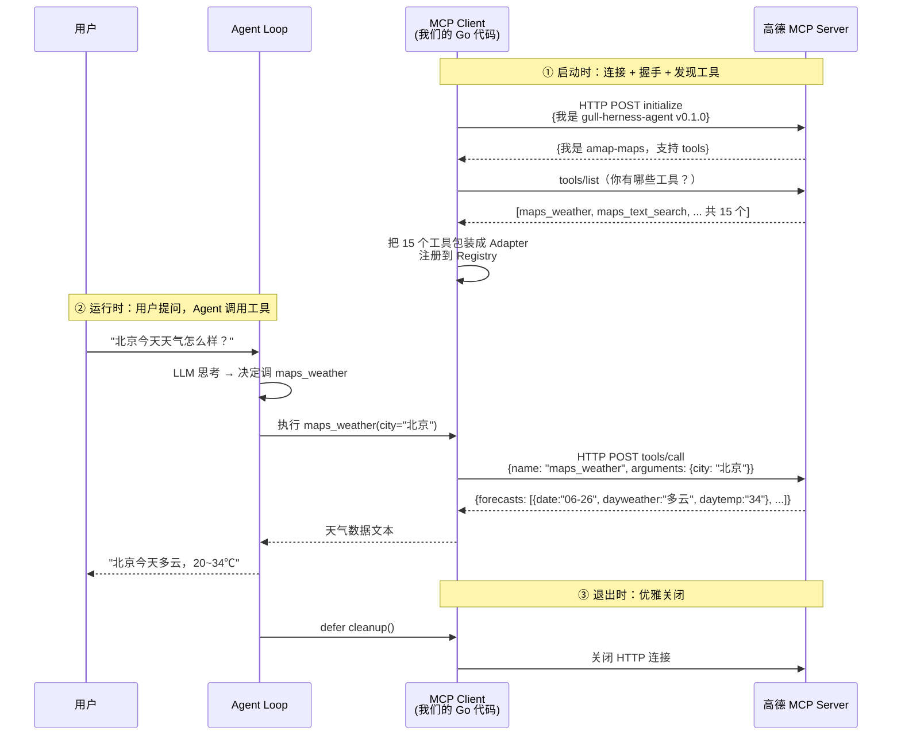

# Day 5：MCP 客户端

## 导语

前四天的 Agent 能查天气、执行命令、读写文件、加载领域知识——但所有这些工具都是我们一行行 Go 代码写的。真实世界里，社区有大量现成的 MCP server：filesystem 能读写任意目录、fetch 能发 HTTP 请求、高德地图能查 POI 和天气、postgres 能查数据库……数千个工具，每个都能给 Agent 用。

今天引入 **MCP（Model Context Protocol）**——让 Agent 通过标准协议连接外部 MCP server，自动发现并调用它们的工具。你只需要写一个 `mcp.json` 配置文件，不用写一行工具实现代码。

关键设计是将 Go 的 `tool.Tool` 接口作为桥接层：MCP server 的工具经过 `Adapter` 适配后进入 Registry，Agent Loop 完全无感知——它分不清 `getWeather` 是本地的还是千里之外 MCP server 提供的。

## 本日目标

使用 Go MCP SDK（`github.com/modelcontextprotocol/go-sdk`）实现客户端，支持 stdio、SSE、Streamable HTTP 三种传输方式，从 `mcp.json` 配置文件加载 MCP server 并自动注册工具。最终用真实的高德地图 MCP server 跑通完整链路。

## 你将学到

- MCP 协议概念：标准化的工具发现与调用协议
- Go MCP SDK 的使用：`CommandTransport`（stdio）、`SSEClientTransport`（SSE）、`StreamableClientTransport`（Streamable HTTP）
- 适配器模式：MCP Tool → `tool.Tool` 接口的桥接
- 配置文件驱动：`mcp.json` 声明 MCP server，代码零改动
- 降级策略：MCP server 不可用时不影响内置工具

---

## 第一步：问题

Day 2 我们实现了 4 个内置工具（weather、bash、file_read、file_write）。但真实场景的需求远不止这些：

- 用户说"帮我查一下 README.md 的内容" → 需要读文件，但 `file_read` 功能有限
- 用户说"搜一下天安门附近的咖啡店" → 需要地图搜索，没有对应工具
- 用户说"查一下数据库中用户数" → 需要数据库查询，更没有

你可以给每个需求写一个 Go tool——但社区已经有几千个 MCP server 实现了这些功能。与其重复造轮子，不如让 Agent 学会"使用别人的工具"。

这就是 MCP 要解决的问题——**统一的外部工具接入协议**。

---

## 第二步：MCP 深度理解

我们从今天的主角——**高德地图 MCP**——出发，一步步搞懂 MCP 到底解决了什么问题。

### 2.1 从一个痛点说起

假设用户对 Agent 说：

> "帮我查一下北京的天气，再搜一下天安门附近有没有咖啡店"

如果没有 MCP，你得自己干这些事：

1. 写一个 `weather` 工具——调高德天气 API，解析 JSON，返回文本
2. 写一个 `poi_search` 工具——调高德搜索 API，解析 JSON，返回文本
3. 每个工具都要处理 API key、HTTP 超时、错误重试、参数校验……
4. 下周产品说"再加个路径规划"，你又得写一个 `direction` 工具

**痛点很明显：工具实现是重复劳动。** 天气 API、搜索 API、路径规划 API——高德早就封装好了，你只是在一遍遍写 HTTP 调用 + JSON 解析的胶水代码。

现在换个思路：**如果高德自己把这些 API 包装成标准工具，你的 Agent 只要"连上去"就能用呢？**

这就是高德地图 MCP server 做的事。它暴露了 15 个工具——天气、搜索、路径规划、地理编码……全部现成。你的 Agent 连上它，立刻拥有这 15 个工具，不用写一行实现代码。

**MCP 就是"让 Agent 连上别人写好的工具服务"的协议。**

### 2.2 MCP 和 Function Calling 是什么关系？

新手最容易搞混这两个概念。用一句话区分：

- **Function Calling**（Day 1-2 已有）：LLM 决定"该调哪个工具"——是**模型和工具**之间的协议
- **MCP**（今天）：Agent 发现"有哪些工具可用"——是**Agent 和工具服务**之间的协议

用高德的例子对照：

| | Function Calling（已有） | MCP（今天） |
|---|---|---|
| **解决的问题** | 模型怎么知道该调天气还是搜索 | 天气和搜索这些工具从哪来 |
| **你写什么** | Go 代码实现 `tool.Tool` | `mcp.json` 声明连哪个 MCP server |
| **工具在哪** | 你的 Go 进程里 | 高德的远程服务器上 |
| **想加路径规划** | 写 Go → 编译 → 部署 | 已经有了，`mcp.json` 里高德自带 |
| **典型动作** | LLM 输出 `tool_calls` | Agent 发 `tools/list` 发现工具 |

两者**配合使用**，不是替代关系：

```
用户："北京天气怎么样"
  → Function Calling 让 LLM 决定调 maps_weather
  → MCP 负责把 maps_weather 的调用转发给高德 server
  → 高德 server 返回天气数据
  → Agent 把数据回填给 LLM，生成自然语言回复
```

**Agent Loop 对 MCP 完全无感知**——它分不清 `maps_weather` 是你写的 Go 工具，还是高德 server 提供的远程工具。这就是后面要讲的"适配器模式"的价值。

### 2.3 MCP 协议长什么样？

MCP 协议分三层，从下往上看：

```
┌──────────────────────────────────────┐
│  MCP 协议层                           │
│  tools/list, tools/call, initialize  │
├──────────────────────────────────────┤
│  JSON-RPC 2.0 消息层                  │
│  请求带 id，响应回传相同 id           │
├──────────────────────────────────────┤
│  传输层 (Transport)                   │
│  stdio / SSE / Streamable HTTP        │
└──────────────────────────────────────┘
```

别被这三层吓到，我们用高德的例子一层层讲。

**传输层**：Agent 怎么和高德 server 通信？高德是远程服务，走 HTTP。具体怎么走 HTTP，后面 2.4 节细讲。

**JSON-RPC 2.0**：通信的"信封格式"。每条消息是一个 JSON，带一个 `id`，收到回复时用相同的 `id` 配对。比如你问"有哪些工具"（id=1），高德回的答案也标着 id=1，你就知道这是对哪个问题的回答。

::: warning 什么是 JSON-RPC 2.0？

上面反复提到 JSON-RPC 2.0，这里展开讲一下——不用深究，知道它长什么样就行。

JSON-RPC 2.0 是一个**远程过程调用（Remote Procedure Call）标准**，简单说就是"怎么用 JSON 调用别人家的函数"。它规定了三种消息：

**① 请求（Request）**——客户端发问，必须带 `id`：

```json
{
  "jsonrpc": "2.0",
  "id": 1,
  "method": "tools/call",
  "params": {
    "name": "maps_weather",
    "arguments": { "city": "北京" }
  }
}
```

**② 响应（Response）**——服务端回答，回传**相同的 `id`**：

```json
{
  "jsonrpc": "2.0",
  "id": 1,
  "result": {
    "content": [{ "type": "text", "text": "{\"forecasts\":[...]}" }]
  }
}
```

**③ 通知（Notification）**——单向通知，**没有 `id`**，对方不需要回复：

```json
{ "jsonrpc": "2.0", "method": "notifications/initialized" }
```

**为什么要有 `id`？** 因为通信可能是异步的——你连着发了两个请求（id=1 查天气、id=2 搜天安门），高德可能先返回 id=2 的结果再返回 id=1 的。靠 `id` 配对，你才知道哪个回答对应哪个问题，不会张冠李戴。

**为什么要有"通知"？** 有些消息不需要对方回答，比如握手完成后的"我初始化好了"（`notifications/initialized`）——发过去就行，不用等。省一个来回。

**MCP 和 JSON-RPC 的关系**：MCP 只是借用了 JSON-RPC 2.0 当信封格式，信封里装的"方法"（`initialize`、`tools/list`、`tools/call`）是 MCP 自己定义的。你可以把 JSON-RPC 理解成 HTTP 的请求/响应模型，MCP 理解成跑在上面的具体 API。

好消息是：**Go MCP SDK 把这些都封装好了**，你不会在代码里看到任何手拼 JSON-RPC 消息的逻辑——只需要调 `ListTools()` 和 `CallTool()`。
:::

**MCP 协议层**：信封里装的"内容"。定义了几个标准方法：

| 方法 | 作用 | 高德例子 |
|------|------|---------|
| `initialize` | 握手，协商版本和能力 | "我是 gull-herness-agent，你是谁？" |
| `tools/list` | 列出所有可用工具 | 高德返回 15 个工具的清单 |
| `tools/call` | 调用某个工具 | 调 `maps_weather`，传 `{"city":"北京"}` |

好消息是：**Go MCP SDK 把传输层和 JSON-RPC 层全封装好了**，你只需要调 `ListTools()` 和 `CallTool()` 两个方法，不用自己拼 JSON-RPC 消息。

### 2.4 三种传输方式——Agent 怎么连上工具服务？

这是新手最迷糊的地方。MCP 有三种"连线方式"（传输层），对应不同场景。我们用高德 + filesystem 两个真实 server 对比：

| 传输方式 | 工具在哪 | 怎么连 | 谁用这种方式 |
|---------|---------|--------|------------|
| **stdio** | 你本机的子进程 | 启动一个程序，通过它的输入/输出管道通信。就像在终端跑 `npx @modelcontextprotocol/server-filesystem /tmp`，程序等着你往 stdin 喂 JSON，处理完往 stdout 吐 JSON | filesystem server（读写本地文件） |
| **SSE**（旧规范，2024 年） | 远程服务器 | 先 `GET /sse` 建立一条 HTTP 长连接，服务器返回一个 endpoint 地址，再 `POST` 到那个地址发请求——两次连接 | 老式远程 MCP server |
| **Streamable HTTP**（新规范，2025 年） | 远程服务器 | 直接往单个端点（如 `https://mcp.amap.com/mcp`）发 POST 请求就行——一次连接搞定，更简单 | **高德地图**、Cloudflare 等新 server |


:::info SSE和Streamable兼容性处理
SSE 和 Streamable HTTP 的握手方式不兼容。你的 Agent 拿到一个 `url`，无法自动确认MCP服务端具体是哪一种协议。所以配置文件里需要 `type` 字段显式声明具体的类型
:::

高德用的是 Streamable HTTP（新规范），所以配置里写 `"type": "streamable"`：

```json
{
  "mcpServers": {
    "amap": {
      "type": "streamable",
      "url": "https://mcp.amap.com/mcp?key=你的key"
    }
  }
}
```

### 2.5 连上高德之后发生了什么？——握手全过程

现在跟着 Agent 的视角，走一遍从"连上高德"到"查到天气"的完整流程。这是今天最关键的一张图：



| 阶段        | 时机 | 做什么 | 高德例子 |
|-----------|------|--------|---------|
| **初始化**   | 启动时（只做一次） | 握手确认身份，`tools/list` 拿到工具清单，每个工具包装成 `Adapter` 注册到 Registry | 连上高德，拿到 15 个工具，注册后和内置 `weather`、`bash` 平起平坐 |
| **运行时调用** | 每次对话 | LLM 通过 Function Calling 决定调哪个工具 → Agent Loop 在 Registry 找到它 → `Adapter` 通过 HTTP 转发给 MCP server → 结果回填给 LLM | 用户问"北京天气"→ LLM 调 `maps_weather` → 转发给高德 → 天气 JSON 回填。**Agent Loop 不知道 `maps_weather` 是远程的** |
| **优雅关闭**  | 程序退出时 | `defer cleanup()` 关闭所有连接，MCP server 释放资源 | 关闭与高德的 HTTP 连接 |

:::info 为什么说"对 Agent Loop 透明"？

仔细看上面三个阶段，**运行时调用**这一步和 Day 1-4 的 Agent Loop 完全一样——依然是 LLM 输出 `tool_calls`、Agent Loop 在 Registry 里找工具、执行、回填 `ToolMessage`。MCP 没有给 Agent Loop 加任何新逻辑。

MCP 的所有复杂性都被压缩在两个地方：

- **初始化阶段**：连上 MCP server、握手、`tools/list` 拉工具清单、包装成 `Adapter` 注册——这些只在启动时做一次，Agent Loop 看不到
- **Adapter 内部**：`Adapter.Execute` 表面上是本地方法调用，内部却通过 `tools/call` 把请求转发给远程 MCP server——这个"本地还是远程"的差异被 Adapter 封装了

所以从 Agent Loop 的视角看，`maps_weather` 和内置的 `weather` 没有任何区别：都是 Registry 里的一个工具，都能 `Dispatch` 执行，都返回文本结果。这就是"**对 Agent Loop 透明**"的含义——你甚至可以把内置 `weather` 删掉，只留高德的 `maps_weather`，Agent Loop 一行代码都不用改。
:::

### 2.6 高德到底给了我哪些工具？

连接成功后，`tools/list` 真实返回的 15 个工具（这就是你的 Agent 免费获得的能力）。这是真实的 JSON-RPC 交互，点击展开查看：

:::details 请求：tools/list

```json
{
  "jsonrpc": "2.0",
  "id": 1,
  "method": "tools/list"
}
```

:::

:::details 响应：15 个工具的清单

```json
{
  "jsonrpc": "2.0",
  "id": 1,
  "result": {
    "tools": [
      {
        "name": "maps_weather",
        "description": "根据城市名称或者标准adcode查询指定城市的天气",
        "inputSchema": {
          "type": "object",
          "properties": {
            "city": { "type": "string", "description": "城市名称或adcode" }
          },
          "required": ["city"]
        }
      },
      {
        "name": "maps_text_search",
        "description": "关键字搜索 API 根据用户输入的关键字进行 POI 搜索，并返回相关的信息",
        "inputSchema": {
          "type": "object",
          "properties": {
            "keywords": { "type": "string", "description": "搜索关键词" }
          },
          "required": ["keywords"]
        }
      },
      {
        "name": "maps_direction_bicycling",
        "description": "骑行路径规划用于规划骑行通勤方案，规划时会考虑天桥、单行线、封路等情况。最大支持 500km 的骑行路线规划",
        "inputSchema": {
          "type": "object",
          "properties": {
            "origin":      { "type": "string", "description": "出发点经纬度，坐标格式为：经度，纬度" },
            "destination": { "type": "string", "description": "目的地经纬度，坐标格式为：经度，纬度" }
          },
          "required": ["origin", "destination"]
        }
      }
    ]
  }
}
```

:::


| 工具名 | 能干嘛 | 用户可以怎么问            |
|-------|--------|--------------------|
| `maps_weather` | 查城市天气 | "北京今天天气怎么样"        |
| `maps_text_search` | 关键字搜 POI | "搜一下天安门"           |
| `maps_around_search` | 周边搜（带半径） | "望京附近 1 公里的咖啡店"    |
| `maps_search_detail` | POI 详情 | "这个店的电话是多少"        |
| `maps_geo` | 地址转坐标 | "望京的经纬度是多少"        |
| `maps_regeocode` | 坐标转地址 | "116.47,39.99 是哪儿" |
| `maps_direction_driving` | 驾车导航 | "从望京开车到国贸怎么走"      |
| `maps_direction_walking` | 步行导航 | "走路到最近的地铁站"        |
| `maps_direction_bicycling` | 骑行导航 | "骑车到公司多远"          |
| `maps_direction_transit_integrated` | 公交地铁 | "坐地铁去北京南站"         |
| `maps_distance` | 测距离 | "望京和国贸隔多远"         |
| `maps_ip_location` | IP 定位 | "这个 IP 在哪个城市"      |
| `maps_schema_navi` | 唤起导航 APP | "打开导航去天安门"         |
| `maps_schema_take_taxi` | 唤起打车 | "帮我叫个车去机场"         |
| `maps_schema_personal_map` | 行程展示 | "把这些地点串成一条路线"      |

响应里的每个工具都包含 `name`（工具名）、`description`（描述）、`inputSchema`（参数 JSON Schema）三要素。我们的 `Adapter` 拿到这个清单后，把每个工具包装成 `tool.Tool` 接口注册进 Registry——从此 LLM 就能通过 Function Calling 调用它们了。

下面单独看一个工具的参数定义。比如 `maps_direction_bicycling` 的 `inputSchema`：

```json
{
  "properties": {
    "origin":      {"type": "string", "description": "出发点经纬度，格式：经度,纬度"},
    "destination": {"type": "string", "description": "目的地经纬度，格式：经度,纬度"}
  },
  "required": ["origin", "destination"],
  "type": "object"
}
```

这个定义其实和前面说的 `Function Call/Tool` 调用时基本一致的，就是要告诉大模型这个调用的名称和具体的参数。
LLM 看了这个 schema 就知道：要调这个工具，必须提供起点和终点的经纬度。如果用户只说了地名，LLM 会先调 `maps_geo` 把地名转成坐标，再调 `maps_direction_bicycling`——**多步推理，全靠工具描述驱动，你一行代码都没写**。

这就是 MCP 的优势：**别人负责写工具和文档，你的 Agent 只负责连上去用**。

---

## 第三步：配置文件设计

配置文件声明所有 MCP server，传输方式由字段组合推断：

- 有 `command` → stdio（启动子进程）
- 有 `url` → HTTP 传输，`type` 区分 SSE 还是 Streamable

我们同时接入一个本地 stdio server 和一个远程 Streamable HTTP server：

```json
{
  "mcpServers": {
    "filesystem": {
      "command": "npx",
      "args": ["-y", "@modelcontextprotocol/server-filesystem", "/tmp"]
    },
    "amap": {
      "type": "streamable",
      "url": "https://mcp.amap.com/mcp?key=你在高德官网申请的key"
    }
  }
}
```

要添加老式 SSE 远程 server，把 `type` 改成 `"sse"`：

```json
{
  "mcpServers": {
    "remote": {
      "type": "sse",
      "url": "http://localhost:8080/sse"
    }
  }
}
```

对应的 Go 类型定义：

```go
type Config struct {
    MCPServers map[string]ServerConfig `json:"mcpServers"`
}

type ServerConfig struct {
    Command string   `json:"command,omitempty"` // stdio: 可执行程序
    Args    []string `json:"args,omitempty"`    // stdio: 命令行参数
    URL     string   `json:"url,omitempty"`     // HTTP: 端点地址
    Type    string   `json:"type,omitempty"`    // HTTP: "sse" 或 "streamable"（默认）
}
```

---

## 第四步：Client 实现——使用官方 SDK

我们不再手写 `JSON-RPC` 客户端，而是使用官方的 Go MCP SDK（`github.com/modelcontextprotocol/go-sdk`）。它提供了完整的 transport 实现和协议握手。

### 核心：connectClient 辅助函数

三种传输方式（stdio、SSE、Streamable HTTP）共享同一个连接逻辑——创建 SDK Client → 传入 Transport → `Connect` 握手。我们提取一个公共辅助函数消除重复：

```go
func connectClient(transport sdkmcp.Transport) (*sdkmcp.ClientSession, error) {
    sdkClient := sdkmcp.NewClient(&sdkmcp.Implementation{
        Name:    "gull-herness-agent",
        Version: "0.1.0",
    }, nil)

    session, err := sdkClient.Connect(context.Background(), transport, nil)
    if err != nil {
        return nil, fmt.Errorf("连接 MCP server 失败: %w", err)
    }
    return session, nil
}
```

### stdio 传输：NewClient

启动子进程，通过 `CommandTransport` 通信。SDK 自动管理子进程生命周期——启动、stdin/stdout 管道、优雅关闭（关 stdin → 等退出 → SIGTERM → SIGKILL）：

```go
func NewClient(command string, args ...string) (*Client, error) {
    cmd := exec.Command(command, args...)
    session, err := connectClient(&sdkmcp.CommandTransport{Command: cmd})
    if err != nil {
        return nil, err
    }
    return &Client{session: session}, nil
}
```

### SSE 传输：NewSSEClient

通过 `SSEClientTransport` 连接远程 HTTP 端点。SDK 内部处理 SSE 事件流的建立、POST 消息发送：

```go
func NewSSEClient(endpoint string) (*Client, error) {
    return NewSSEClientWithHTTP(endpoint, nil)
}

func NewSSEClientWithHTTP(endpoint string, httpClient *http.Client) (*Client, error) {
    transport := &sdkmcp.SSEClientTransport{
        Endpoint:   endpoint,
        HTTPClient: httpClient,
    }
    session, err := connectClient(transport)
    if err != nil {
        return nil, err
    }
    return &Client{session: session}, nil
}
```

### Streamable HTTP 传输：NewStreamableClient

通过 `StreamableClientTransport` 连接远程端点——这是 2025 年新规范，高德、Cloudflare 等新 MCP server 都用它。和 SSE 的区别是握手更简单：直接 `POST` 到单个端点，服务器响应可以是普通 JSON 或 SSE 流：

```go
func NewStreamableClient(endpoint string) (*Client, error) {
    return NewStreamableClientWithHTTP(endpoint, nil)
}

func NewStreamableClientWithHTTP(endpoint string, httpClient *http.Client) (*Client, error) {
    transport := &sdkmcp.StreamableClientTransport{
        Endpoint:   endpoint,
        HTTPClient: httpClient,
    }
    session, err := connectClient(transport)
    if err != nil {
        return nil, err
    }
    return &Client{session: session}, nil
}
```

`NewSSEClient` 和 `NewStreamableClient` 都提供了 `WithHTTP` 变体，允许传入自定义 `*http.Client`——方便加超时、代理、认证头等。

### CallTool：拼接文本结果

MCP server 返回的 `CallToolResult.Content` 是一个 `Content` 接口切片，我们需要提取其中的文本内容：

```go
func (c *Client) CallTool(ctx context.Context, name string, args map[string]any) (string, error) {
    result, err := c.session.CallTool(ctx, &sdkmcp.CallToolParams{
        Name:      name,
        Arguments: args,
    })
    if err != nil {
        return "", fmt.Errorf("调用工具 %q 失败: %w", name, err)
    }

    // 拼接所有 text content 返回
    var text string
    for _, content := range result.Content {
        if tc, ok := content.(*sdkmcp.TextContent); ok {
            text += tc.Text
        }
    }
    return text, nil
}
```

三种构造函数（`NewClient` / `NewSSEClient` / `NewStreamableClient`）共用同一个 `Client` 结构体，`ListTools`、`CallTool`、`Close` 方法完全一样——差异只在构造时传入的 Transport 类型。

---

## 第五步：Adapter——桥接 MCP Tool 到 tool.Tool

MCP server 的 `tools/list` 返回的是 SDK 的 `*sdkmcp.Tool` 类型，我们的 Registry 期望的是 `tool.Tool` 接口。Adapter 是这两者之间的桥梁：

```go
type Adapter struct {
    client  *Client
    sdkTool *sdkmcp.Tool
}
```

### Name / Description：透传 + 兜底

```go
func (a *Adapter) Name() string {
    return a.sdkTool.Name
}

func (a *Adapter) Description() string {
    if a.sdkTool.Description != "" {
        return a.sdkTool.Description
    }
    return a.sdkTool.Name
}
```

`Description` 做了兜底——有些 MCP server 不返回 description，空字符串会让 LLM 困惑，回退到工具名至少有信息。

### Schema：JSON Schema 转换 + 兜底

SDK 的 `Tool.InputSchema` 是 `any` 类型（实际为 `map[string]any`），与 OpenAI 的 `FunctionParameters`（也是 `map[string]any`）底层一致，可以直接赋值。但有些 MCP server 不返回 schema，需要兜底成空 object：

```go
func (a *Adapter) Schema() openai.FunctionDefinitionParam {
    schema := a.sdkTool.InputSchema
    if schema == nil {
        return openai.FunctionDefinitionParam{
            Name:        a.sdkTool.Name,
            Description: openai.String(a.Description()),
            Parameters: openai.FunctionParameters{
                "type":       "object",
                "properties": map[string]any{},
            },
        }
    }

    params, _ := schema.(map[string]any)
    if params == nil {
        params = map[string]any{"type": "object", "properties": map[string]any{}}
    }

    return openai.FunctionDefinitionParam{
        Name:        a.sdkTool.Name,
        Description: openai.String(a.Description()),
        Parameters:  params,
    }
}
```

### Execute：RPC 委托

这是适配器的灵魂——本地方法调用，远程实际执行：

```go
func (a *Adapter) Execute(args map[string]any) (string, error) {
    result, err := a.client.CallTool(context.Background(), a.sdkTool.Name, args)
    if err != nil {
        return "", fmt.Errorf("mcp tool %q 执行失败: %w", a.sdkTool.Name, err)
    }
    return result, nil
}
```

调用链路：

```
模型 tool_calls: {name: "maps_weather", arguments: {"city": "北京"}}
  → Registry.Dispatch("maps_weather", `{"city": "北京"}`)
  → Adapter.Execute(map["city"]: "北京")
  → Client.CallTool("maps_weather", ...)
  → session.CallTool(ctx, &CallToolParams{...})
  → 高德 MCP server 实际查天气
  → 结果字符串返回
```

Registry 不知道 `maps_weather` 背后是本地还是远程——这就是适配器模式的价值。

编译期检查确保一致性：

```go
var _ tool.Tool = (*Adapter)(nil)
```

---

## 第六步：配置加载链路

从 `mcp.json` 到工具注册的完整链路：

```
mcp.json
  → LoadConfig(path)                    // 读取 + 解析 JSON
  → LoadClients(path)                   // 遍历配置，按 type 路由传输方式，逐个启动
  → RegisterAllFromConfig(registry, path) // 获取工具列表，注册到 Registry
  → LoadAll(registry, path)             // 封装以上三步，返回 cleanup 函数
```

### LoadClients：按 type 路由传输方式

这是配置层的核心——根据 `ServerConfig` 的字段组合选择对应的传输方式：

```go
func LoadClients(path string) ([]*Client, error) {
    config, err := LoadConfig(path)
    if err != nil {
        return nil, err
    }

    var clients []*Client
    for name, sc := range config.MCPServers {
        var client *Client
        var err error

        if sc.URL != "" {
            // 有 url → HTTP 传输，根据 type 选择 SSE 或 Streamable HTTP
            switch sc.Type {
            case "sse":
                client, err = NewSSEClient(sc.URL)
            default: // "" 或 "streamable"
                client, err = NewStreamableClient(sc.URL)
            }
        } else {
            // 有 command → stdio 传输
            client, err = NewClient(sc.Command, sc.Args...)
        }

        if err != nil {
            log.Printf("警告: MCP server %q 启动失败: %v", name, err)
            continue
        }
        clients = append(clients, client)
    }

    return clients, nil
}
```

### LoadAll：一行接入

`LoadAll` 是对外暴露的唯一入口。它内部处理了所有降级（配置文件不存在、MCP server 启动失败、工具列表获取失败），最终返回一个 cleanup 函数：

```go
func LoadAll(registry *tool.Registry, configPath string) func() {
    clients, err := RegisterAllFromConfig(registry, configPath)
    if err != nil {
        log.Printf("MCP 配置加载失败，跳过 MCP 工具: %v", err)
        return func() {} // 返回空 cleanup，调用方无需判断 nil
    }
    return func() {
        for _, c := range clients {
            if err := c.Close(); err != nil {
                log.Printf("关闭 MCP client 失败: %v", err)
            }
        }
    }
}
```

关键设计：失败时返回空函数 `func() {}`，确保调用方的 `defer` 始终安全。

### 降级策略

整个加载链路遵循"部分失败不阻断整体"的原则：

| 失败场景 | 行为 |
|---------|------|
| `mcp.json` 不存在 | 日志提示，返回空 cleanup |
| `mcp.json` 解析失败 / 空 | 日志提示，返回空 cleanup |
| 某个 MCP server 启动失败 | 日志警告，继续启动其他 |
| 某个 server 的 tools/list 失败 | 日志警告，继续注册其他 server 的工具 |

无论 MCP 加载是否成功，内置的 weather、bash、file_read、file_write 始终可用。

---

## 第七步：接入 main.go

一行搞定：

```go
// 从 mcp.json 加载 MCP 工具
// 降级策略：配置文件不存在或任何 MCP server 不可用时，不影响内置工具
defer mcp.LoadAll(registry, "mcp.json")()
```

`main.go` 只负责声明"我需要加载 MCP 工具"和"程序退出时记得清理"，所有连接、注册、降级逻辑都在 `mcp` 包内部。

---

## 运行验证：高德地图 MCP 实跑

配置好 `mcp.json` 后启动程序，日志会输出工具注册情况：

```
已注册 15 个 MCP 工具       ← 高德 amap（Streamable HTTP）
已注册 11 个 MCP 工具       ← filesystem（stdio）
```

高德 MCP 暴露的 15 个工具（真实输出）：

| 工具名 | 功能 |
|-------|------|
| `maps_text_search` | 关键字 POI 搜索 |
| `maps_around_search` | 周边搜（带半径） |
| `maps_search_detail` | POI 详情查询 |
| `maps_weather` | 城市天气查询 |
| `maps_geo` | 地理编码（地址 → 坐标） |
| `maps_regeocode` | 逆地理编码（坐标 → 地址） |
| `maps_direction_driving` | 驾车路径规划 |
| `maps_direction_walking` | 步行路径规划 |
| `maps_direction_bicycling` | 骑行路径规划 |
| `maps_direction_transit_integrated` | 公交综合路径规划 |
| `maps_distance` | 距离测量 |
| `maps_ip_location` | IP 定位 |
| `maps_schema_navi` | 唤起导航 |
| `maps_schema_take_taxi` | 唤起打车 |
| `maps_schema_personal_map` | 行程规划展示 |

## 对话示例

先以天气查询为例，完整展示一轮 Agent Loop 背后的 API 层交互——发给 LLM 什么、LLM 返回什么、工具执行后怎么回填。后面两个场景省略 API 层细节，只展示工具调用和结果。

---

### 场景一：查天气（完整 API 层）

```
用户: "北京今天天气怎么样？"
```

##### iteration 1

**发给 LLM 的请求**（messages 数组，tools 已含 maps_weather 等 15 个 MCP 工具，此处只展示 maps_weather 一个）：

:::details 请求体
```json
{
  "messages": [
    { "role": "system", "content": "你是助手，必要时调用工具获取信息..." },
    { "role": "user", "content": "北京今天天气怎么样？" }
  ],
  "tools": [
    {
      "type": "function",
      "function": {
        "name": "maps_weather",
        "description": "根据城市名称或者标准adcode查询指定城市的天气",
        "parameters": {
          "type": "object",
          "properties": {
            "city": { "type": "string", "description": "城市名称或adcode" }
          },
          "required": ["city"]
        }
      }
    }
  ]
}
```
:::

**LLM 返回**（决定调用 `maps_weather`）：

:::details 响应体
```json
{
  "role": "assistant",
  "content": null,
  "tool_calls": [
    {
      "id": "call_abc123",
      "type": "function",
      "function": {
        "name": "maps_weather",
        "arguments": "{\"city\":\"北京\"}"
      }
    }
  ]
}
```
:::

**工具执行**（Agent Loop 调 Registry → Adapter → MCP Client → 高德 server）：

```
[tool] maps_weather(city="北京")
→ HTTP POST https://mcp.amap.com/mcp  (tools/call)
← {"city":"北京市","forecasts":[
     {"date":"2026-06-26","dayweather":"多云","daytemp":"34","nighttemp":"20"},
     {"date":"2026-06-27","dayweather":"雷阵雨","daytemp":"34","nighttemp":"23"}
   ]}
```

**结果回填为 ToolMessage**，messages 数组现在变成：

:::details 回填后的 messages 数组
```json
[
  { "role": "system", "content": "你是助手..." },
  { "role": "user", "content": "北京今天天气怎么样？" },
  { "role": "assistant", "content": null, "tool_calls": [{"id":"call_abc123","function":{"name":"maps_weather","arguments":"{\"city\":\"北京\"}"}}] },
  { "role": "tool", "tool_call_id": "call_abc123", "content": "{\"city\":\"北京市\",\"forecasts\":[{\"date\":\"2026-06-26\",\"dayweather\":\"多云\",\"daytemp\":\"34\",\"nighttemp\":\"20\"},{\"date\":\"2026-06-27\",\"dayweather\":\"雷阵雨\",\"daytemp\":\"34\",\"nighttemp\":\"23\"}]}" }
]
```
:::

##### iteration 2

带着回填后的 messages 再次请求 LLM。这次 LLM 已经拿到天气数据，不再发起工具调用，直接生成最终回复：

:::details 响应体
```json
{
  "role": "assistant",
  "content": "北京今天多云，气温 20~34℃，南风 1-3 级。明天有雷阵雨，气温 23~34℃。",
  "tool_calls": null
}
```
:::

模型未发起工具调用，结束 agent loop。最终回复：

```
北京今天多云，气温 20~34℃，南风 1-3 级。明天有雷阵雨，气温 23~34℃。
```

---

### 场景二：搜索天安门

```
用户: "搜一下天安门"

=== iteration 1 ===
[tool] maps_text_search(keywords="天安门")
→ {"pois":[
    {"name":"天安门","address":"长安街北侧","typecode":"110202"},
    {"name":"天安门东(地铁站)","address":"1号线/八通线","typecode":"150500"},
    {"name":"天安门广场","address":"东长安街","typecode":"110210"},
    ...
  ]}

找到多个结果：天安门（长安街北侧）、天安门东地铁站（1号线）、天安门广场（东长安街）等。
```

### 场景三：地理编码

```
用户: "望京的经纬度是多少？"

=== iteration 1 ===
[tool] maps_geo(address="北京市朝阳区望京")
→ {"results":[{"province":"北京市","district":"朝阳区",
    "location":"116.470293,39.996171","level":"住宅区"}]}

望京的经纬度是 116.470293, 39.996171（北京市朝阳区）。
```

---

Agent Loop 完全无感知这些工具来自远程 MCP server——对它来说 `maps_weather` 和内置的 `weather` 没有区别。从 API 层看，MCP 工具和内置工具的 `tool_calls` 格式完全一致，区别只在 `Adapter.Execute` 内部是本地执行还是远程 RPC。

---

## 排错指南

MCP 是新手最容易翻车的地方。常见问题：

### 1. stdio server：npx 没装或网络慢

```
警告: MCP server "filesystem" 启动失败: exec: "npx": executable file not found in $PATH
```

**原因**：没装 Node.js，或 `npx` 不在 PATH 里。

**排查**：手动跑一下确认 server 能起来：

```bash
npx -y @modelcontextprotocol/server-filesystem /tmp
# 应该输出类似 "Secure MCP Filesystem Server running on stdio" 的日志
```

### 2. Streamable HTTP：key 错误或网络不通

```
警告: MCP server "amap" 启动失败: 连接 MCP server 失败: ...
```

**原因**：高德 key 无效、网络不通、或端点 URL 拼错。

**排查**：用 curl 验证端点能响应：

```bash
curl -X POST https://mcp.amap.com/mcp?key=你的key \
  -H "Content-Type: application/json" \
  -H "Accept: application/json, text/event-stream" \
  -d '{"jsonrpc":"2.0","id":1,"method":"initialize","params":{}}'
```

能收到 JSON 响应说明端点正常，问题在 key 或 SDK 版本。

### 3. `type` 填错：SSE server 用了 streamable

```
警告: MCP server "remote" 启动失败: 连接 MCP server 失败: ...
```

**原因**：老式 SSE server 的端点（通常路径含 `/sse`）被当成了 Streamable HTTP 连接，握手失败。

**排查**：检查 `mcp.json` 里 `type` 是否匹配——URL 含 `/sse` 的大概率要写 `"type": "sse"`，含 `/mcp` 的大概率是 `"streamable"`（默认）。

### 4. 工具注册数为 0

```
已注册 0 个 MCP 工具
```

**原因**：MCP server 连上了但 `tools/list` 返回空，或 server 不暴露工具（只暴露 resources / prompts）。

**排查**：这个 server 可能不是工具型 server，换一个或检查 server 文档。

---

## 完整可运行代码

::: details mcp/mcp.go（完整代码）

```go
package mcp

import (
    "context"
    "fmt"
    "net/http"
    "os/exec"

    sdkmcp "github.com/modelcontextprotocol/go-sdk/mcp"
)

// Client 封装了 MCP SDK 的客户端和会话管理。
//
// 支持三种传输方式：
//   - stdio：通过 CommandTransport 与子进程通信（NewClient）
//   - SSE：通过 SSEClientTransport 与 HTTP 端点通信（NewSSEClient）
//   - Streamable HTTP：通过 StreamableClientTransport（NewStreamableClient）
type Client struct {
    session *sdkmcp.ClientSession
}

// NewClient 启动 MCP server 子进程（stdio 传输）并完成初始化握手。
func NewClient(command string, args ...string) (*Client, error) {
    cmd := exec.Command(command, args...)
    session, err := connectClient(&sdkmcp.CommandTransport{Command: cmd})
    if err != nil {
        return nil, err
    }
    return &Client{session: session}, nil
}

// NewSSEClient 通过 SSE（Server-Sent Events）传输连接到 MCP server。
func NewSSEClient(endpoint string) (*Client, error) {
    return NewSSEClientWithHTTP(endpoint, nil)
}

func NewSSEClientWithHTTP(endpoint string, httpClient *http.Client) (*Client, error) {
    transport := &sdkmcp.SSEClientTransport{
        Endpoint:   endpoint,
        HTTPClient: httpClient,
    }
    session, err := connectClient(transport)
    if err != nil {
        return nil, err
    }
    return &Client{session: session}, nil
}

// NewStreamableClient 通过 Streamable HTTP 传输连接到 MCP server。
func NewStreamableClient(endpoint string) (*Client, error) {
    return NewStreamableClientWithHTTP(endpoint, nil)
}

func NewStreamableClientWithHTTP(endpoint string, httpClient *http.Client) (*Client, error) {
    transport := &sdkmcp.StreamableClientTransport{
        Endpoint:   endpoint,
        HTTPClient: httpClient,
    }
    session, err := connectClient(transport)
    if err != nil {
        return nil, err
    }
    return &Client{session: session}, nil
}

// connectClient 是统一的连接辅助函数，减少三种构造函数的重复代码。
func connectClient(transport sdkmcp.Transport) (*sdkmcp.ClientSession, error) {
    sdkClient := sdkmcp.NewClient(&sdkmcp.Implementation{
        Name:    "gull-herness-agent",
        Version: "0.1.0",
    }, nil)

    session, err := sdkClient.Connect(context.Background(), transport, nil)
    if err != nil {
        return nil, fmt.Errorf("连接 MCP server 失败: %w", err)
    }
    return session, nil
}

func (c *Client) ListTools(ctx context.Context) ([]*sdkmcp.Tool, error) {
    result, err := c.session.ListTools(ctx, nil)
    if err != nil {
        return nil, fmt.Errorf("列出工具失败: %w", err)
    }
    return result.Tools, nil
}

func (c *Client) CallTool(ctx context.Context, name string, args map[string]any) (string, error) {
    result, err := c.session.CallTool(ctx, &sdkmcp.CallToolParams{
        Name:      name,
        Arguments: args,
    })
    if err != nil {
        return "", fmt.Errorf("调用工具 %q 失败: %w", name, err)
    }

    var text string
    for _, content := range result.Content {
        if tc, ok := content.(*sdkmcp.TextContent); ok {
            text += tc.Text
        }
    }
    return text, nil
}

func (c *Client) Close() error {
    return c.session.Close()
}
```

:::

::: details mcp/tool.go（完整代码）

```go
package mcp

import (
    "context"
    "fmt"

    "gull-herness-agent/tool"

    sdkmcp "github.com/modelcontextprotocol/go-sdk/mcp"
    "github.com/openai/openai-go"
)

type Adapter struct {
    client  *Client
    sdkTool *sdkmcp.Tool
}

func NewAdapter(client *Client, t *sdkmcp.Tool) *Adapter {
    return &Adapter{client: client, sdkTool: t}
}

func (a *Adapter) Name() string {
    return a.sdkTool.Name
}

func (a *Adapter) Description() string {
    if a.sdkTool.Description != "" {
        return a.sdkTool.Description
    }
    return a.sdkTool.Name
}

func (a *Adapter) Schema() openai.FunctionDefinitionParam {
    schema := a.sdkTool.InputSchema
    if schema == nil {
        return openai.FunctionDefinitionParam{
            Name:        a.sdkTool.Name,
            Description: openai.String(a.Description()),
            Parameters: openai.FunctionParameters{
                "type":       "object",
                "properties": map[string]any{},
            },
        }
    }

    params, _ := schema.(map[string]any)
    if params == nil {
        params = map[string]any{"type": "object", "properties": map[string]any{}}
    }

    return openai.FunctionDefinitionParam{
        Name:        a.sdkTool.Name,
        Description: openai.String(a.Description()),
        Parameters:  params,
    }
}

func (a *Adapter) Execute(args map[string]any) (string, error) {
    result, err := a.client.CallTool(context.Background(), a.sdkTool.Name, args)
    if err != nil {
        return "", fmt.Errorf("mcp tool %q 执行失败: %w", a.sdkTool.Name, err)
    }
    return result, nil
}

var _ tool.Tool = (*Adapter)(nil)
```

:::

::: details mcp/config.go（完整代码）

```go
package mcp

import (
    "context"
    "encoding/json"
    "fmt"
    "log"
    "os"

    "gull-herness-agent/tool"
)

type Config struct {
    MCPServers map[string]ServerConfig `json:"mcpServers"`
}

type ServerConfig struct {
    Command string   `json:"command,omitempty"`
    Args    []string `json:"args,omitempty"`
    URL     string   `json:"url,omitempty"`
    Type    string   `json:"type,omitempty"` // "sse" 或 "streamable"（默认）
}

func LoadConfig(path string) (*Config, error) {
    data, err := os.ReadFile(path)
    if err != nil {
        return nil, fmt.Errorf("读取配置文件 %s 失败: %w", path, err)
    }

    var config Config
    if err := json.Unmarshal(data, &config); err != nil {
        return nil, fmt.Errorf("解析配置文件 %s 失败: %w", path, err)
    }

    if len(config.MCPServers) == 0 {
        return nil, fmt.Errorf("配置文件中没有 mcpServers 定义")
    }

    return &config, nil
}

func LoadClients(path string) ([]*Client, error) {
    config, err := LoadConfig(path)
    if err != nil {
        return nil, err
    }

    var clients []*Client
    for name, sc := range config.MCPServers {
        var client *Client
        var err error

        if sc.URL != "" {
            switch sc.Type {
            case "sse":
                client, err = NewSSEClient(sc.URL)
            default: // "" 或 "streamable"
                client, err = NewStreamableClient(sc.URL)
            }
        } else {
            client, err = NewClient(sc.Command, sc.Args...)
        }

        if err != nil {
            log.Printf("警告: MCP server %q 启动失败: %v", name, err)
            continue
        }
        clients = append(clients, client)
    }

    return clients, nil
}

func RegisterAllFromConfig(registry *tool.Registry, configPath string) ([]*Client, error) {
    clients, err := LoadClients(configPath)
    if err != nil {
        return nil, err
    }

    for _, client := range clients {
        tools, err := client.ListTools(context.Background())
        if err != nil {
            log.Printf("警告: 获取 MCP 工具列表失败: %v", err)
            continue
        }
        for _, t := range tools {
            registry.Register(NewAdapter(client, t))
        }
        log.Printf("已注册 %d 个 MCP 工具", len(tools))
    }

    return clients, nil
}

func LoadAll(registry *tool.Registry, configPath string) func() {
    clients, err := RegisterAllFromConfig(registry, configPath)
    if err != nil {
        log.Printf("MCP 配置加载失败，跳过 MCP 工具: %v", err)
        return func() {}
    }
    return func() {
        for _, c := range clients {
            if err := c.Close(); err != nil {
                log.Printf("关闭 MCP client 失败: %v", err)
            }
        }
    }
}
```

:::

::: details mcp.json

```json
{
  "mcpServers": {
    "filesystem": {
      "command": "npx",
      "args": ["-y", "@modelcontextprotocol/server-filesystem", "/tmp"]
    },
    "amap": {
      "type": "streamable",
      "url": "https://mcp.amap.com/mcp?key=你在高德官网申请的key"
    }
  }
}
```

:::

::: details main.go（MCP 相关部分）

```go
// 从 mcp.json 加载 MCP 工具
// 降级策略：配置文件不存在或任何 MCP server 不可用时，不影响内置工具
defer mcp.LoadAll(registry, "mcp.json")()
```

:::

---

## 关键设计决策

### 为什么用官方 SDK 而不是手写 JSON-RPC？

三个理由：一是代码量——手写需要 200+ 行（JSON-RPC 编解码、stdio 管道管理、子进程生命周期），用 SDK 后 `Client` 不到 120 行；二是健壮性——SDK 的 `CommandTransport` 处理了边缘情况（子进程僵尸、管道破裂、超时关闭），自己写很容易遗漏；三是教学价值——学会使用官方 SDK 比学会写 JSON-RPC 解析器更有实际意义。

### 为什么配置文件需要 `type` 字段区分 SSE 和 Streamable？

MCP 协议规范本身**不定义配置文件格式**——这是各个客户端自己的私有问题。我们参考 VS Code Copilot MCP 和 Cline 的做法，用 `type` 字段区分。

根本原因是**两种 HTTP 传输握手方式不兼容**：旧 SSE（2024 规范）先 `GET /sse` 拿 endpoint 再 POST；新 Streamable HTTP（2025 规范）直接 POST 到单端点。客户端无法自动兼容两种 server，必须让用户声明。

默认值设为 `streamable` 是面向未来——2025 年新出的远程 MCP server（高德、Cloudflare 等）基本都用 Streamable HTTP，用户不填 `type` 也能工作。遇到老 server 时显式写 `"type": "sse"` 即可。

### 为什么叫 Adapter 而不是 Tool？

包名是 `mcp`，类型叫 `Tool` 会跟 `tool.Tool` 接口混淆——`mcp.Tool` vs `tool.Tool`，读代码时容易搞混。`Adapter` 语意更明确：它的职责就是把 MCP tool 适配成 `tool.Tool` 接口。

### 为什么用配置文件而不是命令行参数？

配置文件有两层好处：一是声明式——用户只需要描述"我要哪些 MCP server"，不用写 Go 代码；二是标准化——`mcp.json` 的格式和 Claude Desktop 一致，用户已有的 MCP 配置可以直接复用。

### 为什么降级策略这么激进？

MCP server 是"额外能力"，不是"核心能力"。如果 filesystem MCP server 因为 npx 版本问题启动失败，Agent 应该仍然能用 weather 和 bash 工作，而不是直接崩溃。每一个 MCP server 的失败都是独立的——一个 filesystem server 挂了不应该影响 amap server。

### defer 模式：LoadAll 为什么返回 func() 而不是 (cleanup, error)？

如果返回 `(func(), error)`，调用方需要写 `if err == nil { defer cleanup() }`。改成只返回 `func()`，失败时返回空函数，调用方可以直接 `defer mcp.LoadAll(...)()`——一行搞定，不需要任何判断。

### Adapter 的 Description 和 Schema 为什么要兜底？

不是所有 MCP server 都严格遵守规范返回完整的 `description` 和 `inputSchema`。空 description 会让 LLM 不知道工具该不该用；nil schema 会导致 OpenAI API 报错。兜底逻辑虽然只有几行，但让 Agent 对"不规范"的 MCP server 也能工作。

---

## 一句话总结

今天让 Agent 从"只能用自己写的工具"升级为"能用整个 MCP 生态的工具"——通过 Go MCP SDK + Adapter 适配器 + JSON 配置驱动，新增一个 MCP server 只需要在 `mcp.json` 加两行配置，不用写一行 Go 代码。高德地图 15 个工具、filesystem 11 个工具，全部零代码接入。

## 下一步

Day 6：消息管理与对话压缩——解决上下文超限问题，让 Agent 能支持超长对话。
