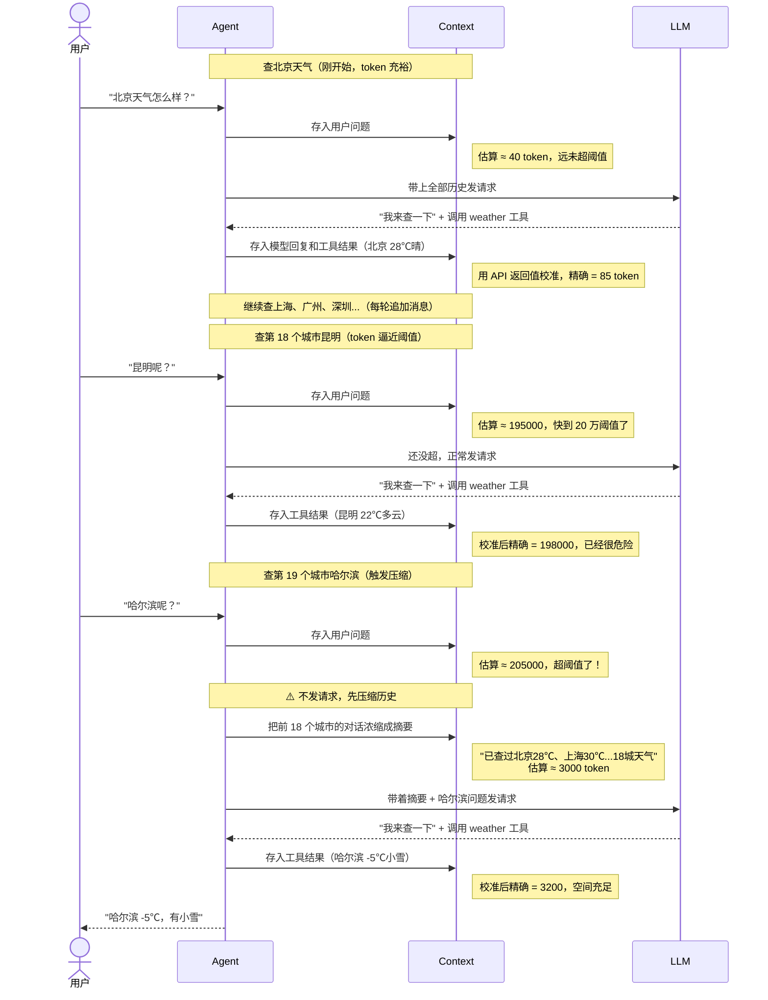

# Day 6：消息管理与对话压缩

## 导语

前五天的 Agent 越来越能干——能查天气、执行命令、读写文件、加载 Skill、连 MCP server。但有一个问题一直被我们回避：**对话越长，token 越多，钱越花越多，直到撞上上下文窗口上限直接报错。**

一个真实的场景：用户让 Agent 读 5 个文件、改 3 处代码、跑 2 次测试——每一步都往消息列表里追加内容，工具返回的结果动辄上千 token。几轮下来，`messages` 切片可能累积到几万 token，下一次请求要么超限报错，要么慢得像蜗牛。

### 为什么必须压缩

大模型的上下文窗口是有限的——即使最新模型支持 `200k` 甚至 `1M(5*200K)` token，也终有上限。而 Agent 的消息列表是**只增不减**的：

- 每轮对话：用户问题 + 模型回复 + 工具调用 + 工具结果，至少追加 4 条消息
- 工具结果尤其占空间：读一个文件可能几千 token，跑一次测试输出上万 token
- 20 轮下来，消息列表轻松突破 10 万 token

如果不做任何处理，只有两个结局：

| 情况 | 后果 |
|------|------|
| token 超过模型上限 | API 直接报错，对话中断，任务完不成 |
| token 没超但很大 | 每次请求都带着几万 token 的历史，**又慢又贵**——响应延迟翻倍，费用线性增长 |

### 压缩有什么好处

**摘要压缩**的核心思路是：把前面的历史对话交给 LLM 浓缩成一段摘要，替换掉旧消息。比如 20 轮天气查询的详细对话（5 万 token），压缩成"已查过北京 28℃、上海 30℃...共 18 个城市的天气"这样的摘要（几百 token）。

好处是三重的：

1. **避免超限崩溃**：压缩后 token 大幅下降，对话能继续进行而不是中断
2. **省钱省时**：后续每次请求只带几百 token 的摘要，而不是几万 token 的原始历史
3. **保留关键信息**：LLM 生成的摘要会保留"已经做了什么、结论是什么"，Agent 不会因为压缩而丢失上下文

当然压缩也有代价——**细节会有损失**。摘要保留了"北京 28℃"这个结论，但可能丢失"用户当时还问了穿衣建议"这种细节。所以压缩的时机很重要：太早压缩丢失上下文，太晚压缩已经超限。我们的策略是设一个阈值，快到上限才压缩，在"保留上下文"和"避免超限"之间取平衡。

今天引入 **Context**——一个专门管理消息历史和 token 用量的组件。它对 Agent Loop 完全透明：Agent 只管往里 Append 消息、读 Messages 发请求，Context 在幕后负责 token 估算、超阈值压缩、用 API 真实值校准。

关键设计是 **"估算 + 校准"双轨制**：Append 时用字符比例粗略估算增量（够预判用），API 返回后用 `usage` 字段精确校准（消除误差）。两者配合，既能在发请求前预判是否该压缩，又不会因估算误差累积而失控。

## 本日目标

把 Day 5 里散落在 `Agent` 结构体中的 `messages` 和 `tokenThresh` 抽出来，交给独立的 `Context` 组件管理。实现 token 估算器、LLM 摘要器、自动压缩流程，让 Agent 能支持超长对话而不崩溃。

## 你将学到

- 上下文管理的核心矛盾：精确计数 vs 提前预判
- Token 估算的"双轨制"：估算增量 + usage 校准
- 摘要压缩策略：用 LLM 把历史对话浓缩成一段文本
- 接口拆分设计：`TokenEstimator` / `Summarizer` / `Context` 各司其职
- 降级策略：没有摘要器时如何粗暴裁剪

---

## 第一步：问题

回顾 Day 5 的 `Agent` 结构体：

```go
type Agent struct {
    client      openai.Client
    registry    *tool.Registry
    prompt      *prompt.Builder
    messages    []openai.ChatCompletionMessageParamUnion  // ← 消息直接存在这
    maxIter     int
    tokenThresh int                                       // ← 阈值也散落在这
    logger      *log.Logger
}
```

这个设计有三个问题：

### 1.1 职责分散

`Agent` 既负责调度 LLM、执行工具，又负责管理消息列表和 token 阈值。随着功能增长，`Agent.Run()` 会越来越臃肿。

### 1.2 token 判断是"事后诸葛亮"

Day 5 的做法是：发请求 → 拿到 `resp.Usage.TotalTokens` → 判断是否超阈值 → 超了就终止。这意味着：

- **每次请求都先把超限的消息全发出去**，浪费一次 API 调用
- **终止而不是压缩**，对话直接断掉，用户体验差

我们想要的是：**在发请求前就预判"快超了"，先压缩再继续**，而不是等撞墙了才停。

### 1.3 无法应对超长对话

假设用户让 Agent 处理一个大型任务，来回调用工具 20 次，消息累积到 15 万 token。如果只是"超限终止"，Agent 根本完不成任务。真正需要的是**压缩历史**——把前面 19 轮对话浓缩成一段摘要，腾出空间继续工作。

---

## 第二步：核心思路——双轨制 token 计数

要实现"发请求前预判"，就得在 Append 消息时估算 token 增量。但估算一定有误差，怎么办？

答案是 **双轨制**：

| 时机 | 数据来源 | 作用 |
|------|---------|------|
| Append 消息时 | `CharRatioEstimator` 估算 | 预判"是否快超了" |
| API 返回后 | `resp.Usage.TotalTokens` 精确值 | 校准总量，消除累积误差 |

具体流程：

```
Append(msg) → totalTokens += estimate(msg)    ← 估算增量
    ↓
判断 totalTokens >= threshold？                ← 预判
    ↓ 是
Compact() → 压缩历史，totalTokens 重置         ← 压缩
    ↓
发请求 → 拿到 resp.Usage                       ← 真实值
    ↓
UpdateUsage(usage) → totalTokens = usage.Total ← 校准
```

::: tip 为什么不直接用 usage，还要估算？
`usage` 是"上一次请求"的值——它告诉你"刚才那一次花了多少 token"，但你想在"发下一次请求前"预判。Append 新消息后到发请求前这段空窗期，只能靠估算。等请求一回来，立刻用真实值覆盖估算值，误差不会跨轮累积。
:::

---

## 第三步：Token 估算器

先实现估算侧。定义接口：

```go
package agent

import (
	"github.com/openai/openai-go"
	"github.com/openai/openai-go/packages/param"
)

// TokenEstimator 估算消息列表的 token 数量。
//
// 为什么需要估算而不是直接用 API 返回的 usage？
// 因为 usage 是"上一次请求"的精确值，而我们想在"发下一次请求前"预判是否该压缩。
// 估算用于 Append 时的增量计算，usage 用于请求回来后的校准——两者配合。
type TokenEstimator interface {
	// Estimate 估算单条消息的 token 数。
	Estimate(msg openai.ChatCompletionMessageParamUnion) int
}
```

接口只管"估算单条消息"，至于怎么估算是实现类的事。最简单的实现是**字符比例法**：

```go
// CharRatioEstimator 基于字符比例的粗略 token 估算器。
//
// 不依赖外部库，按经验比例估算：约 2.5 字符/token（中英文混杂的折中值）。
// 精度不高，但用于"判断是否该压缩"足够了——真正的精确值由 API 的 usage 校准。
type CharRatioEstimator struct {
	ratio float64
}

// NewCharRatioEstimator 创建一个字符比例估算器，默认比例 2.5 字符/token。
func NewCharRatioEstimator() *CharRatioEstimator {
	return &CharRatioEstimator{ratio: 2.5}
}

// Estimate 估算单条消息的 token 数。
func (e *CharRatioEstimator) Estimate(msg openai.ChatCompletionMessageParamUnion) int {
	text := extractMessageText(msg)
	charCount := float64(len([]rune(text)))
	return int(charCount/e.ratio) + 4 // +4 为 role 等结构开销的粗略补偿
}
```

### 3.1 为什么是 2.5 字符/token？

这是经验值，来自三方面权衡：

| 语言 | 字符/token | 说明 |
|------|-----------|------|
| 纯中文 | ≈ 1.5 | 一个汉字通常 1-2 个 token |
| 纯英文 | ≈ 4.0 | 一个单词通常 1-2 个 token，平均 4 字符/词 |
| 中英混杂 | ≈ 2.5 | 折中取值，覆盖大多数实际场景 |

::: warning 精度够吗？
不够——但够用。估算的唯一目的是"判断是否该压缩"，这是个布尔决策：超阈值 or 没超。即使估算误差 ±20%，也只是在 16 万 token 还是 24 万 token 压缩的区别，不影响正确性。而且每轮 API 返回后都会用 `usage` 校准，误差不会跨轮累积。

如果你追求精确，可以用 `tiktoken-go` 库做 BPE 分词——但那会引入依赖、增加初始化成本，对这个布尔判断来说性价比不高。
:::

### 3.2 提取消息文本的细节

openai-go 的消息类型是**结构体 union**，不是接口，不能直接 `switch msg.(type)`。每种角色（system/user/assistant/tool）的 Content 字段类型还各不相同，需要逐层提取：

```go
// extractMessageText 从 ChatCompletionMessageParamUnion 中提取文本内容。
//
// openai-go 的消息是结构体 union（OfSystem/OfUser/OfAssistant/OfTool 指针字段），
// Content 也是 union（OfString/OfArrayOfContentParts）。逐层取值即可。
func extractMessageText(msg openai.ChatCompletionMessageParamUnion) string {
	if !param.IsOmitted(msg.OfSystem) {
		return systemContentToString(msg.OfSystem.Content)
	}
	if !param.IsOmitted(msg.OfUser) {
		return userContentToString(msg.OfUser.Content)
	}
	if !param.IsOmitted(msg.OfAssistant) {
		return assistantContentToString(msg.OfAssistant)
	}
	if !param.IsOmitted(msg.OfTool) {
		return toolContentToString(msg.OfTool.Content)
	}
	return ""
}
```

::: details 为什么 openai-go 用结构体 union 而不是 interface？
Go 的 `oneof` 语义没有语言级支持。openai-go 选择用结构体 + 多个指针字段（`OfSystem *...`、`OfUser *...`）模拟 union：哪个字段非 nil 就是哪种类型。配合 `param.IsOmitted()` 判断字段是否设置，`MarshalJSON` 时只序列化非空的那一个。

相比 `interface{}` + 类型断言，这种方式有编译期类型检查，但取值时确实啰嗦一些。
:::

---

## 第四步：摘要器

估算器解决了"预判"，但真正解决超限问题的是**压缩**。压缩的核心是把一堆历史消息变成一条摘要，这需要 LLM 介入。

```go
package agent

import (
	"context"
	"fmt"

	"github.com/openai/openai-go"
)

// Summarizer 将一组历史消息压缩成一条摘要消息。
//
// 上下文窗口有限，对话太长时不能无限堆积消息。Summarizer 负责把
// "前面聊了什么"浓缩成一段文本，替换掉旧消息，从而腾出 token 空间。
type Summarizer interface {
	// Summarize 把 messages 压缩成一条 system 摘要消息。
	Summarize(ctx context.Context, messages []openai.ChatCompletionMessageParamUnion) (openai.ChatCompletionMessageParamUnion, error)
}
```

实现也很直白：把历史消息拼成文本，喂给 LLM 让它输出摘要：

```go
// LLMSummarizer 用 LLM 自身来做摘要的实现。
//
// 思路：把要压缩的历史消息作为 user 输入喂给 LLM，让它输出一段
// "对话摘要"。这条摘要作为新的 system 消息替换掉旧消息。
type LLMSummarizer struct {
	client openai.Client
	model  string
}

// NewLLMSummarizer 创建一个基于 LLM 的摘要器。
func NewLLMSummarizer(client openai.Client, model string) *LLMSummarizer {
	return &LLMSummarizer{client: client, model: model}
}

// Summarize 调用 LLM 生成摘要。
func (s *LLMSummarizer) Summarize(ctx context.Context, messages []openai.ChatCompletionMessageParamUnion) (openai.ChatCompletionMessageParamUnion, error) {
	// 构造摘要请求：system 指令 + 把历史消息原样作为上下文
	summarizePrompt := "你是一个对话摘要助手。请把下面的历史对话浓缩成一段简洁的摘要，" +
		"保留关键事实、已做的决策、待办事项和重要上下文。用中文输出，不要遗漏关键信息。"

	// 把历史消息拼成文本作为 user 输入
	historyText := "以下是历史对话，请摘要：\n\n"
	for _, m := range messages {
		historyText += fmt.Sprintf("[%s] %s\n", roleOf(m), extractMessageText(m))
	}

	resp, err := s.client.Chat.Completions.New(ctx, openai.ChatCompletionNewParams{
		Model: s.model,
		Messages: []openai.ChatCompletionMessageParamUnion{
			openai.SystemMessage(summarizePrompt),
			openai.UserMessage(historyText),
		},
	})
	if err != nil {
		return openai.ChatCompletionMessageParamUnion{}, fmt.Errorf("摘要请求失败: %w", err)
	}
	if len(resp.Choices) == 0 {
		return openai.ChatCompletionMessageParamUnion{}, fmt.Errorf("摘要响应为空")
	}

	summary := resp.Choices[0].Message.Content
	// 摘要作为 system 消息返回，带前缀标识
	return openai.SystemMessage("[对话摘要] " + summary), nil
}
```

::: tip 摘要为什么用 system 消息而不是 user 消息？
摘要是对"对话背景"的描述，属于上下文设定而非用户指令。放在 system 角色里，LLM 会把它当作"环境信息"参考，而不是某个参与者的发言。加 `[对话摘要]` 前缀是为了让 LLM 知道这段话的来源——避免它把摘要内容当成新的用户请求去响应。
:::

---

## 第五步：Context——把估算和压缩串起来

有了 `TokenEstimator` 和 `Summarizer`，`Context` 就是把它们串起来的调度者。

### 5.1 结构体定义

```go
// Context 管理对话历史和 token 用量。
//
// 它对 Agent 透明：Agent 只管 Append 消息、读 Messages、拿 Tokens 判断是否该压缩。
// token 计数策略：totalTokens = 上次 API 返回的 usage + 本次新追加消息的估算增量。
//   - 每次 Append 时，增量 = estimator.Estimate(新消息)，累加到 totalTokens
//   - 每次 API 返回后，用 resp.Usage.TotalTokens 校准 totalTokens（消除估算误差）
//   - Compact（压缩）后，totalTokens 重置为摘要消息的估算值
//
// 这样既能在"发请求前"预判，又能在"请求回来后"用真实值纠偏。
type Context struct {
	messages   []openai.ChatCompletionMessageParamUnion
	estimator  TokenEstimator
	summarizer Summarizer
	threshold  int64 // token 阈值，超过则触发压缩

	// totalTokens 当前上下文的 token 总量估算。
	// 初始为 0，Append 时累加估算增量，UpdateUsage 时被 API 真实值校准。
	totalTokens int64
}
```

构造函数用函数式选项，和 `Agent` 保持一致的风格：

```go
// ContextOption 是 Context 的函数式选项。
type ContextOption func(*Context)

// NewContext 创建一个 Context 实例。
//
// 默认使用 CharRatioEstimator，阈值 200_000。
// 如需 LLM 摘要压缩，用 WithSummarizer 传入。
func NewContext(opts ...ContextOption) *Context {
	c := &Context{
		estimator: NewCharRatioEstimator(),
		threshold: 200_000,
	}
	for _, opt := range opts {
		opt(c)
	}
	return c
}

// WithEstimator 设置 token 估算器。
func WithEstimator(e TokenEstimator) ContextOption {
	return func(c *Context) { c.estimator = e }
}

// WithSummarizer 设置摘要器（启用 Compact 能力的前提）。
func WithSummarizer(s Summarizer) ContextOption {
	return func(c *Context) { c.summarizer = s }
}
```

### 5.2 Append——估算增量的入口

```go
// Append 追加一条消息，并累加估算的 token 增量。
func (c *Context) Append(msg openai.ChatCompletionMessageParamUnion) {
	c.messages = append(c.messages, msg)
	c.totalTokens += int64(c.estimator.Estimate(msg))
}

// AppendMany 批量追加消息。
func (c *Context) AppendMany(msgs ...openai.ChatCompletionMessageParamUnion) {
	for _, m := range msgs {
		c.Append(m)
	}
}

// Messages 返回当前消息列表（只读视图，调用方不应修改）。
func (c *Context) Messages() []openai.ChatCompletionMessageParamUnion {
	return c.messages
}

// Tokens 返回当前 token 总量估算。
func (c *Context) Tokens() int64 {
	return c.totalTokens
}
```

核心是 `Append` 里那一行 `c.totalTokens += int64(c.estimator.Estimate(msg))`——每次追加消息，估算增量累加进去。

### 5.3 UpdateUsage——校准的入口

```go
// UpdateUsage 用 API 返回的真实 usage 校准 token 总量。
//
// 为什么需要校准？因为 Append 时用的是估算值，会有误差。
// 每次 API 请求回来后，usage 包含了精确的 prompt_tokens + completion_tokens，
// 用它覆盖 totalTokens，消除累积误差。
//
// 调用时机：Agent 每次收到 LLM 响应后调用。
func (c *Context) UpdateUsage(usage openai.CompletionUsage) {
	c.totalTokens = usage.TotalTokens
}

// ShouldCompact 判断是否需要压缩上下文。
func (c *Context) ShouldCompact() bool {
	return c.totalTokens >= c.threshold
}
```

`UpdateUsage` 只有一行——直接用 `usage.TotalTokens` 覆盖 `totalTokens`。这一步是"校准"的关键：无论之前估算累积了多少误差，API 回来后立刻用真实值纠偏，下一轮从精确值重新开始累加。

### 5.4 Compact——压缩历史

```go
// Compact 压缩上下文：把历史消息替换成一条摘要。
//
// 流程：
//  1. 保留第一条 system prompt（它通常是角色设定，不该被压缩）
//  2. 把其余消息交给 Summarizer 生成摘要
//  3. 用 [system prompt, 摘要] 替换整个 messages
//  4. totalTokens 重置为估算值（后续会被下一次 API usage 校准）
//
// 如果没配置 Summarizer，则降级为"删除最早的一半消息"的粗暴策略。
func (c *Context) Compact(ctx context.Context) error {
	if len(c.messages) <= 2 {
		return nil // 消息太少，不压缩
	}

	// 保留第一条 system 消息（如果有）
	var head []openai.ChatCompletionMessageParamUnion
	rest := c.messages
	if isSystemMessage(c.messages[0]) {
		head = c.messages[:1]
		rest = c.messages[1:]
	}

	var newMessages []openai.ChatCompletionMessageParamUnion
	newMessages = append(newMessages, head...)

	if c.summarizer != nil {
		summary, err := c.summarizer.Summarize(ctx, rest)
		if err != nil {
			return fmt.Errorf("压缩上下文失败: %w", err)
		}
		newMessages = append(newMessages, summary)
		log.Printf("[context] 已压缩 %d 条历史消息为 1 条摘要", len(rest))
	} else {
		// 降级策略：只保留最近一半消息
		half := len(rest) / 2
		newMessages = append(newMessages, rest[half:]...)
		log.Printf("[context] 无摘要器，降级裁剪：删除最早 %d 条消息", half)
	}

	c.messages = newMessages
	// 重新估算总 token
	c.totalTokens = 0
	for _, m := range c.messages {
		c.totalTokens += int64(c.estimator.Estimate(m))
	}
	return nil
}
```

几个设计要点：

| 决策 | 理由 |
|------|------|
| 保留第一条 system 消息 | 它是角色设定/系统指令，压缩掉会让 Agent"失忆"自己是谁 |
| 消息 ≤2 时不压缩 | 就 2 条消息还压缩没意义，避免无谓的 LLM 调用 |
| 无 Summarizer 时降级裁剪 | 保证即使没配摘要器，Context 也能工作（删一半比崩溃强） |
| 压缩后重新估算 token | 摘要是新消息，旧 token 数作废，从 0 重新累加 |

::: warning 压缩后 token 估算准吗？
不准——但很快会被校准。压缩后 `totalTokens` 是基于摘要消息重新估算的，有误差。但紧接着的下一次 API 请求会返回真实 `usage`，`UpdateUsage` 会立刻纠偏。所以压缩后的估算只是"过渡值"，不会影响正确性。
:::

---

## 第六步：Agent 接入 Context

`Context` 准备好后，`Agent` 的改造是减法——删掉 `messages` 和 `tokenThresh`，换成 `ctx *Context`。

### 6.1 结构体瘦身

```go
type Agent struct {
	client   openai.Client
	registry *tool.Registry
	prompt   *prompt.Builder
	ctx      *Context
	maxIter  int
	logger   *log.Logger
}
```

对比 Day 5 的 6 个字段，现在只剩 5 个——消息管理和 token 阈值的职责完全移交给了 `Context`。

### 6.2 新增 WithContext 选项

```go
// WithContext 设置上下文管理器。
//
// 如果不传，Run() 会创建一个默认的 Context（CharRatio 估算器，阈值 200_000）。
func WithContext(c *Context) Option {
	return func(a *Agent) { a.ctx = c }
}
```

如果调用方不传 `Context`，`Run()` 会兜底创建一个默认的——保证向后兼容。

### 6.3 Run 循环的改造

改造集中在三处：初始化 Context、用真实 usage 校准、超阈值时压缩。

```go
func (a *Agent) Run() {
	// 如果没传 Context，创建默认的
	if a.ctx == nil {
		a.ctx = NewContext()
	}

	// 前置 System Prompt
	if a.prompt != nil {
		sysMsg := a.prompt.Build()
		a.ctx.Append(openai.SystemMessage(sysMsg))
	}

	for i := 1; i <= a.maxIter; i++ {
		fmt.Printf("=== iteration %d ===\n", i)

		params := openai.ChatCompletionNewParams{
			Model:    "deepseek-v4-flash",
			Messages: a.ctx.Messages(),
			Tools:    a.registry.ToChatCompletionTools(),
		}

		// 记录请求体
		a.logRequest(i, params)

		resp, err := a.client.Chat.Completions.New(context.Background(), params)
		if err != nil {
			a.handleError(err)
			return
		}

		// 记录响应体
		a.logResponse(i, resp)

		// 用 API 返回的真实 usage 校准 token 总量
		a.ctx.UpdateUsage(resp.Usage)
		fmt.Printf("[usage] prompt=%d completion=%d total=%d (threshold=%d)\n",
			resp.Usage.PromptTokens, resp.Usage.CompletionTokens,
			a.ctx.Tokens(), a.ctx.Threshold())

		// token 超阈值：先尝试压缩，压缩后仍超则终止
		if a.ctx.ShouldCompact() {
			log.Printf("[context] token %d 达到阈值 %d，触发压缩（iteration %d）",
				a.ctx.Tokens(), a.ctx.Threshold(), i)
			if err := a.ctx.Compact(context.Background()); err != nil {
				log.Printf("[context] 压缩失败: %v", err)
				return
			}
			// 压缩后重新判断，如果还是超阈值，说明压缩空间有限，终止
			if a.ctx.ShouldCompact() {
				log.Printf("[context] 压缩后 token %d 仍超阈值 %d，终止迭代", a.ctx.Tokens(), a.ctx.Threshold())
				return
			}
		}

		choice := resp.Choices[0]
		msg := choice.Message
		a.ctx.Append(msg.ToParam())

		// finish_reason == "length"：达到 token 上限
		if choice.FinishReason == "length" {
			log.Printf("达到 token 上限，终止迭代（iteration %d）", i)
			if msg.Content != "" {
				fmt.Println(msg.Content)
			}
			return
		}

		// 没有工具调用：模型已给出最终回复
		if len(msg.ToolCalls) == 0 {
			fmt.Println(msg.Content)
			log.Printf("模型未发起工具调用，结束 agent loop（iteration %d）", i)
			return
		}

		// 执行模型请求的所有工具调用，并把结果作为 tool 消息回填
		for _, call := range msg.ToolCalls {
			result := a.dispatch(call)
			fmt.Printf("[tool] %s -> %s\n", call.Function.Name, result)
			a.ctx.Append(openai.ToolMessage(result, call.ID))
		}
	}

	log.Printf("达到最大迭代次数 %d，终止 agent loop", a.maxIter)
}
```

对比 Day 5 的 `Run()`，关键变化：

| Day 5 | Day 6 |
|-------|-------|
| `a.messages = append(...)` | `a.ctx.Append(...)` |
| `used := resp.Usage.TotalTokens` 然后 if 终止 | `a.ctx.UpdateUsage(resp.Usage)` 然后 if 压缩 |
| 超阈值直接 return | 超阈值先 Compact，压缩后仍超才 return |

### 6.4 main.go 的调用方式

```go
	// 创建上下文管理器：带 LLM 摘要能力，token 超阈值时自动压缩历史
	ctx := agent.NewContext(
		agent.WithSummarizer(agent.NewLLMSummarizer(client, "deepseek-v4-flash")),
		agent.WithThreshold(200_000),
		agent.WithInitialMessages(
			openai.UserMessage("北京今天天气怎么样？"),
		),
	)

	// 创建 Agent 并启动
	ag := agent.New(client,
		agent.WithRegistry(registry),
		agent.WithPrompt(pb),
		agent.WithContext(ctx),
		agent.WithMaxIterations(10),
		agent.WithLogger(logger),
	)
	ag.Run()
```

`WithMessages` 和 `WithTokenThreshold` 两个选项被替换成了 `WithContext` 一个——配置项更聚合，职责更清晰。

---

## 第七步：完整对话流程演示

把双轨制串起来看一个完整流程。假设用户连续查询多个城市的天气，每轮都触发工具调用、消息不断累积，直到逼近阈值触发压缩：



注意几个关键点：

1. **每轮都有两次 token 判断**：存入消息后估算预判，API 返回后用真实值校准
2. **压缩发生在"发请求前"**：不是等 API 报错才处理，而是存入消息后发现超阈值就主动压缩
3. **压缩后立即继续**：不像 Day 5 那样终止，而是腾出空间继续回答哈尔滨的天气
4. **误差不累积**：每轮 API 返回都纠偏，估算误差只影响一轮内的预判

---

## 设计要点：为什么这样拆？

### 为什么 token 计数要"双轨制"而不是只用 usage？

这是今天的核心设计决策。只用 `usage` 的问题：它是"过去时"——告诉你"刚才那次请求花了多少 token"，但你需要在"发下一次请求前"做决策。

考虑这个场景：第 5 轮 API 返回 `usage=180,000`，然后你 Append 了一条 30,000 token 的工具结果。如果只看 `usage`，你会以为还剩 20,000 空间，发请求后才发现超限报错。

双轨制下：Append 时 `totalTokens = 180,000 + 30,000 = 210,000`，立刻触发压缩，避免报错。等压缩后发请求，`usage` 回来再校准。

**估算负责预判，usage 负责纠偏**——两者缺一不可。

### 为什么不把估算器、摘要器都内联进 Context？

因为它们是**可替换的策略**：

- 估算器：`CharRatioEstimator` 够用，但有人可能想要 `TiktokenEstimator`（精确）
- 摘要器：`LLMSummarizer` 效果好，但有人可能想要 `RuleBasedSummarizer`（快、便宜、不调 LLM）

用接口拆分后，`Context` 只依赖抽象，换实现不用改 `Context` 代码。这也是为什么 `Context` 的 `Compact` 有降级逻辑——没传 `Summarizer` 也能工作，只是粗暴裁剪而已。

### 为什么保留第一条 system 消息不压缩？

system 消息是 Agent 的"身份设定"——Day 3 花了一整天构建的 Identity、Skills、Rules、Working Context 全在里面。压缩掉它，Agent 就"忘记自己是谁"了，后续行为会偏离设定。

摘要只压缩"对话历史"（user/assistant/tool 的来回），不碰"角色设定"。

### 为什么压缩后还要再判断一次 ShouldCompact？

极端情况：历史消息太多，即使压缩成摘要，摘要本身 + system prompt 可能仍然超阈值（比如 system prompt 就有 15 万 token）。这种情况下继续循环没意义，直接终止更合理。

这也是防御性编程——`Compact` 不保证一定能降到阈值以下，调用方需要自己判断结果。

### 为什么 Context 对 Agent 透明，而不是让 Agent 直接管理？

如果 `Agent` 直接持有 `messages` 和 `totalTokens`，每加一个功能（日志、持久化、多轮压缩策略）都要改 `Agent.Run()`。抽出 `Context` 后：

- `Agent` 只负责调度（调 LLM、执行工具、判断终止）
- `Context` 只负责状态管理（存消息、算 token、压缩历史）

后续如果要加"持久化到磁盘"、"多轮对话恢复"，只需要扩展 `Context`，`Agent` 一行不用改。

---

## 一句话总结

今天让 Agent 拥有了"超长对话"能力——通过 `Context` 组件 + 双轨制 token 计数（估算预判 + usage 校准）+ LLM 摘要压缩，Agent 在上下文快满时会主动压缩历史而不是崩溃终止。三个组件各司其职：`TokenEstimator` 管估算、`Summarizer` 管压缩、`Context` 管调度，`Agent` 只管调用，一行状态都不用自己维护。

## 下一步

Day 7：整合与 CLI 交互——把这七天的所有组件串成一个可交互的命令行 Agent，支持多轮对话、流式输出、会话持久化。
