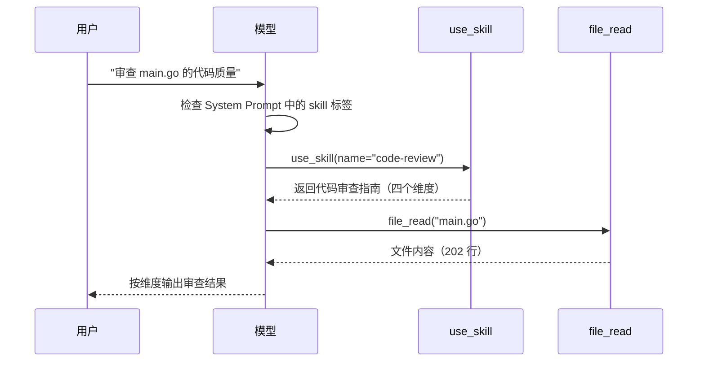
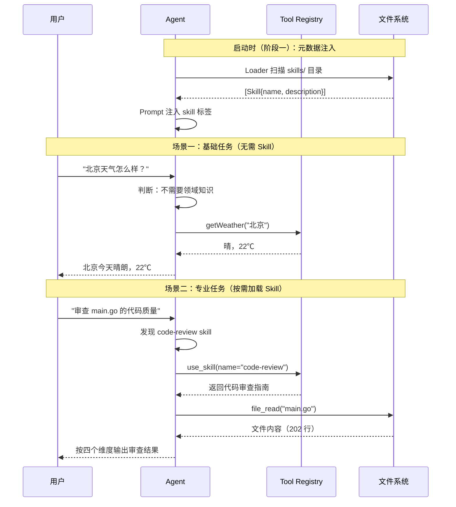

# Day 4：Skill 机制

## 导语

前三天的 Agent 已经能干活了——调用工具、遵守准则、知道自己在哪。但它是一个"通用助手"：你让它审查代码，它不知道从哪几个维度看；让它做性能优化，它不知道该注意什么指标。

今天引入 **Skill 机制**——每个 Skill 是一个专业领域的"子脑"，Agent 按需加载，不撑爆 System Prompt。关键设计是"元数据常驻，正文按需"：启动时只加载 Skill 的名称和描述（轻量标签），运行时模型需要某个领域知识时才调用 `use_skill` 工具获取完整指南。

相比"把所有知识塞进 System Prompt"，Skill 机制有四个核心优势：

- **按需加载**：元数据常驻（每个 Skill 仅 ~50 token），正文只在模型判断"需要这个领域知识"时才加载——问天气不带审查指南，只有审查代码时才加载
- **零代码扩展**：新增一个 Skill 只需在 `skills/` 下创建目录 + SKILL.md 文件，不用改一行 Go 代码。Loader 自动发现，UseSkillTool 自动注册
- **职责分离**：Skill 负责"领域知识"，Tool 负责"可执行操作"，System Prompt 的准则负责"行为约束"——三者各司其职，互不耦合
- **可组合**：可以同时加载多个 Skill（如 code-review + security-check），模型在不同轮次按需调用不同的 use_skill，组合出不同的专业能力

## 本日目标

实现 SKILL.md 文件解析 + 目录扫描 + `use_skill` 工具，让 Agent 在面对专业任务时自动加载领域知识。

## 你将学到

- SKILL.md 的 frontmatter + 正文格式规范
- 手写一个简单的 `---` 分隔符状态机解析器
- Loader 目录扫描：遍历 → 发现 → 加载
- System Prompt 中 XML 标签的 Skill 表示法：`<skill name="..." description="..."/>`
- `use_skill` 工具：模型主动加载领域知识的完整链路

---

## 第一步：问题

看看 Day 3 的 System Prompt（身份 + 3 条准则 + 环境信息，总共约 400 token）——还很短，没问题。

但假如你想让 Agent 会"代码审查"，把审查指南塞进去：

```
你是一个全能的编程助手...

当审查代码时，请按以下维度检查：
1. 代码质量：命名是否清晰？函数是否过长？
2. 潜在 Bug：空指针、边界条件、并发安全
3. 安全性：SQL 注入、路径遍历、敏感信息
4. 最佳实践：错误处理、资源释放、魔法数字

按优先级列出问题并给出修改建议...
```

这个"审查指南"就 300 token。再加一个"性能优化"Skill（200 token）、一个"部署检查"Skill（250 token）——每个 Skill 都塞进 prompt，很快 System Prompt 就会膨胀到上千 token。

更关键的是——**用户问"北京天气怎么样"的时候，这些审查指南完全没有用**，却白白消耗 token，还稀释了真正重要的行为准则。

**我们需要的是："元数据常驻，正文按需"。**

---

## 第二步：SKILL.md 设计

### SKILL.md 格式

每个 Skill 是一个目录，里面有一个 `SKILL.md` 文件。分为两个区域：

```markdown
---
name: code-review
description: 代码审查助手，检查代码质量、安全性和最佳实践
---

当用户要求审查代码时，请按以下维度进行系统性检查：

1. **代码质量**：命名是否清晰？函数是否过长？逻辑是否复杂？
2. **潜在 Bug**：空指针、数组越界、边界条件、并发安全
3. **安全性**：SQL 注入风险、路径遍历、敏感信息泄露
4. **最佳实践**：错误处理是否完整？资源是否正确释放？

审查完成后，按优先级（高 / 中 / 低）列出问题并给出修改建议。
```

- `---` 之间是 **frontmatter**：`name` 和 `description`——元数据，轻量
- `---` 之后是**正文**：领域知识指南——可能很长，按需加载

### 两阶段加载流程

```
启动时（阶段一）：
  skills/code-review/SKILL.md
    → Loader 扫描 → 解析 frontmatter
    → 注入 System Prompt 元数据:
      <skill name="code-review" description="代码审查助手..."/>

运行时（阶段二）：
  用户: "审查 main.go"
    → 模型看到 <skill> 标签，知道有 code-review skill
    → 调用 use_skill(name="code-review")
    → 拿到完整审查指南（SKILL.md 正文）
    → 按指南逐维度审查代码
```

阶段一保证模型 **知道有哪些 Skill 可用**（只有几十个 token），阶段二保证模型 **需要时才加载完整内容**（不浪费 token）。

---

## 第三步：解析 SKILL.md

聚焦 `skill/skill.go`。核心是一个 `Parse()` 函数，输入 Skill 目录路径，输出 `*Skill` 结构体。

### Skill 结构体

```go
type Skill struct {
    Name        string   // frontmatter name
    Description string   // frontmatter description
    Prompt      string   // 正文（SKILL.md 的 body 部分）
    Path        string   // Skill 目录路径
}
```

### frontmatter 解析

解析逻辑就是一个小小的**状态机**——用一个 `inFrontmatter` 布尔变量追踪当前在 frontmatter 内还是外：

```go
func Parse(skillDir string) (*Skill, error) {
    mdPath := filepath.Join(skillDir, "SKILL.md")
    f, err := os.Open(mdPath)
    if err != nil {
        return nil, err
    }
    defer f.Close()

    s := &Skill{Path: skillDir}

    scanner := bufio.NewScanner(f)
    var inFrontmatter bool
    var frontmatterLines []string
    var bodyLines []string

    for scanner.Scan() {
        line := scanner.Text()
        trimmed := strings.TrimSpace(line)

        if trimmed == "---" {             // 遇到分割线
            inFrontmatter = !inFrontmatter // 切换状态
            continue
        }

        if inFrontmatter {
            frontmatterLines = append(frontmatterLines, trimmed)
        } else {
            bodyLines = append(bodyLines, line)
        }
    }

    // 解析 frontmatter 的 key: value 行
    for _, fl := range frontmatterLines {
        parts := strings.SplitN(fl, ":", 2)
        if len(parts) != 2 {
            continue
        }
        key := strings.TrimSpace(parts[0])
        val := strings.TrimSpace(parts[1])

        switch key {
        case "name":
            s.Name = val
        case "description":
            s.Description = val
        }
    }

    // 去掉正文首尾空行
    // ... Trim bodyLines ...

    s.Prompt = strings.Join(bodyLines, "\n")
    return s, nil
}
```

关键设计：

- **`inFrontmatter` 状态切换**：第一次遇到 `---` 进入 frontmatter，第二次遇到退出。没有引入任何第三方 YAML 库，几行代码就完成了解析
- **`strings.SplitN(fl, ":", 2)`**：只在第一个 `:` 处切分，因为 description 中可能包含冒号（如"代码质量：命名、函数长度"）
- **正文保留原始换行**：不做额外处理，直接 `strings.Join` 还原

:::tip
为什么不用 `gopkg.in/yaml.v3`？两个原因：一是教学——让你看到"状态机+简单文本解析"能解决什么问题；二是依赖最小化——多一个第三方库就多一份维护成本。
:::

---

## 第四步：目录扫描

有了解析单个 SKILL.md 的能力，接下来需要**自动发现** `skills/` 目录下的所有 Skill。这就是 `skill/loader.go` 的职责。

### 扫描逻辑

```go
type Loader struct {
    dirs []string  // 要扫描的目录列表
}

func NewLoader(dirs ...string) *Loader {
    return &Loader{dirs: dirs}
}

func (l *Loader) Load() ([]*Skill, error) {
    var skills []*Skill

    for _, dir := range l.dirs {
        entries, err := os.ReadDir(dir)
        if err != nil {
            if os.IsNotExist(err) {
                continue  // 目录不存在 → 静默跳过
            }
            return nil, fmt.Errorf("读取 skill 目录 %s 失败: %w", dir, err)
        }

        for _, entry := range entries {
            if !entry.IsDir() {
                continue
            }

            skillDir := filepath.Join(dir, entry.Name())
            mdPath := filepath.Join(skillDir, "SKILL.md")

            if _, err := os.Stat(mdPath); err != nil {
                continue  // 子目录中无 SKILL.md → 跳过
            }

            s, err := Parse(skillDir)
            if err != nil {
                return nil, fmt.Errorf("解析 skill %s 失败: %w", skillDir, err)
            }

            skills = append(skills, s)
        }
    }

    return skills, nil
}
```

扫描层级很清晰：

```
dirs[0] = "./skills"
  ├── entries (os.ReadDir)
  │   ├── code-review/        ← IsDir()? yes
  │   │   └── SKILL.md        ← os.Stat 存在? yes → Parse()
  │   ├── deploy-check/       ← 没有 SKILL.md → 跳过
  │   └── README.md           ← IsDir()? no → 跳过
```

两个容错设计：
1. **目录不存在不报错**：`os.IsNotExist(err)` 时静默跳过。用户不需要手动 `mkdir skills/`——Agent 启动时不报错，有 Skill 才加载
2. **目录名即 Skill 名**：`code-review/` 目录 → `code-review` Skill。不依赖 frontmatter 的 name，避免扫描阶段就读取文件

---

## 第五步：注入元数据

Skill 加载后，如何让模型知道它们的存在？通过 `PromptBuilder.WithSkills()` 注入元数据标签。

### 注入代码

```go
// prompt/prompt.go 中的 Build() 方法
if len(b.skills) > 0 {
    sb.WriteString("# 已加载的 Skill\n")
    for _, s := range b.skills {
        sb.WriteString(fmt.Sprintf(
            `<skill name="%s" description="%s"/>` + "\n",
            s.Name, s.Description,
        ))
    }
    sb.WriteString("\n")
}
```

### 生成效果

```
# 已加载的 Skill
<skill name="code-review" description="代码审查助手，检查代码质量、安全性和最佳实践"/>
```

:::tip 为什么用 XML 标签？
`<skill name="..." description="..."/>` 比 `- code-review: 描述` 更结构化。大模型对标签式 schema 的解析更准确——name 和 description 的边界不会混淆，而且跟 Function Calling 的 XML 输出风格一致。
:::

**注意：这里只注入元数据**（几十个 token），不注入 SKILL.md 正文（可能几百上千 token）。正文通过下一步的 `use_skill` 工具按需获取。

---

## 第六步：use_skill 工具

启动时注入的是"菜单"——模型知道有哪些 Skill，但不知道每个 Skill 的详细内容。需要时，模型通过 `use_skill` 工具来"点菜"。

### 工具实现

```go
// tool/use_skill.go

type UseSkillTool struct {
    skills []*skill.Skill  // 持有全部 Skill 的引用
}

func (t *UseSkillTool) Name() string {
    return "use_skill"
}

func (t *UseSkillTool) Description() string {
    return "加载指定 Skill 的完整说明文档。" +
        "当任务涉及某个专业领域（如代码审查、性能优化等）时，" +
        "先调用此工具获取该 Skill 的详细指南和行为规范。" +
        "可用 Skill 的名称请参考 System Prompt 中的 <skill> 标签。"
}

func (t *UseSkillTool) Execute(args map[string]any) (string, error) {
    name, ok := args["name"].(string)
    if !ok || name == "" {
        return "", fmt.Errorf("缺少必填参数: name")
    }

    for _, s := range t.skills {
        if s.Name == name {
            if s.Prompt == "" {
                return fmt.Sprintf(
                    `<skill name=%q/>（该 Skill 没有额外的说明文档）`, name,
                ), nil
            }
            // 返回完整的 SKILL.md 正文，用 <skill> 标签包裹
            return fmt.Sprintf(
                `<skill name=%q>\n%s\n</skill>`, name, s.Prompt,
            ), nil
        }
    }

    return "", fmt.Errorf("未找到 Skill: %s", name)
}
```

和前几天的工具不同，`UseSkillTool` 不是纯函数——它**持有 Skill 数据**，与 `skill.Loader` 有协作关系。

### 工作流程

```
用户: "审查 main.go 的代码质量"

模型看到 System Prompt 中有 <skill name="code-review" .../>
    ↓
模型决定: 我需要先了解 code-review 的审查标准
    ↓
调用 use_skill(name="code-review")
    ↓
拿到返回结果:
    <skill name="code-review">
    当用户要求审查代码时，请按以下维度...
    1. 代码质量：...
    2. 潜在 Bug：...
    3. 安全性：...
    4. 最佳实践：...
    </skill>
    ↓
模型: 用 file_read 读取 main.go → 按四个维度逐一审查 → 输出结果
```



这就是"按需加载"的完整链路：模型判断需要 → 调工具加载 → 用加载到的知识完成任务。多余的 Skill 不占用本轮 token。

---

## 第七步：接入 main.go

随着 Day 4 的 Skill 加入，`main()` 的初始化流程经历了四次进化：

| Day | main() 的核心职责 | 新增 |
|-----|------------------|------|
| Day 1 | 创建 client → 硬编码 tools → 调用 runAgentLoop | 最基本的 Agent |
| Day 2 | + Registry 注册 4 个 Tool | 工具可插拔 |
| Day 3 | + PromptBuilder 组装 System Prompt | Prompt 结构化 |
| Day 4 | + Loader 扫描 Skill → WithSkills 注入 → UseSkillTool 注册 | 领域知识可扩展 |

**Day 4 的 main() 核心部分**：

```go
func main() {
    // ... client 初始化 ...

    // 1. 注册基础工具
    registry := tool.NewRegistry()
    registry.Register(tool.NewWeatherTool())
    registry.Register(tool.NewBashTool())
    registry.Register(tool.NewFileReadTool())
    registry.Register(tool.NewFileWriteTool())

    // 2. 加载 Skill
    loader := skill.NewLoader("./skills")
    skills, _ := loader.Load()

    // 3. 根据 Skill 注册 use_skill 工具
    if len(skills) > 0 {
        registry.Register(tool.NewUseSkillTool(skills))
    }

    // 4. 组装 System Prompt（含 Skill 元数据标签）
    pb := prompt.NewBuilder().
        WithIdentity(prompt.DefaultIdentity).
        WithSkills(skills).                // 注入 <skill> 标签
        WithRule(prompt.RuleSelfDebug).
        WithRule(prompt.RuleReadBeforeWrite).
        WithRule(prompt.RuleFailGracefully).
        WithWorkingContext()

    // 5. 启动 Agent
    messages := []openai.ChatCompletionMessageParamUnion{
        openai.SystemMessage(pb.Build()),
        openai.UserMessage("北京今天天气怎么样？"),
    }
    runAgentLoop(client, registry, messages)
}
```

注意第 3 步的顺序——`UseSkillTool` 必须在 `skills` 加载之后才能创建和注册。

---

## 第八步：验证

用两个场景验证 Skill 机制没有破坏基础能力，且专业任务得到了增强。

### 场景一：基础能力不受影响

```
用户: "北京今天天气怎么样？"

=== iteration 1 ===
[tool] getWeather -> 北京 当前天气：晴，气温 22℃，湿度 55%
=== iteration 2 ===
模型未发起工具调用，结束 agent loop
北京今天天气晴朗，气温 22℃，适合户外活动～
```

即使 System Prompt 里现在多了一行 `<skill name="code-review" .../>`，天气查询仍然能正确完成——模型判断这个任务不需要代码审查领域知识，所以不会调用 `use_skill`。

### 场景二：代码审查任务

```
用户: "审查 main.go 的代码质量"

=== iteration 1 ===
[tool] use_skill -> <skill name="code-review">
当用户要求审查代码时，请按以下维度...
1. 代码质量：...
2. 潜在 Bug：...
3. 安全性：...
4. 最佳实践：...
</skill>
=== iteration 2 ===
[tool] file_read -> 文件: main.go（共 202 行，显示第 1-202 行）
 1|package main
 2|
 3|import (
 4|   "context"
...
=== iteration 3 ===
模型未发起工具调用，结束 agent loop

审查结果：
【代码质量 - 高】main() 函数 202 行，建议拆分为多个子函数
【潜在 Bug - 中】第 44 行 defer 中的 error 被静默忽略
【最佳实践 - 低】第 195 行使用了硬编码的 magic number 200_000
```

✅ 模型先加载了 code-review 指南，再按指南的四个维度系统性地审查代码。

### 两阶段加载流程图



---

## 完整可运行代码

当前项目结构：

```
.
├── main.go
├── skill/
│   ├── skill.go          # Skill 结构体 + Parse()
│   └── loader.go         # Loader 目录扫描
├── skills/
│   └── code-review/
│       └── SKILL.md       # 示例 Skill
├── tool/
│   ├── tool.go            # Tool 接口 + Registry
│   ├── weather.go         # WeatherTool
│   ├── bash.go            # BashTool
│   ├── file_read.go       # FileReadTool
│   ├── file_write.go      # FileWriteTool
│   └── use_skill.go       # UseSkillTool
└── prompt/
    ├── prompt.go          # Builder（含 WithSkills）
    └── system.go          # 默认常量
```

::: details skill/skill.go（核心：Parse 函数）

```go
package skill

import (
    "bufio"
    "os"
    "path/filepath"
    "strings"
)

type Skill struct {
    Name        string
    Description string
    Prompt      string
    Path        string
}

func Parse(skillDir string) (*Skill, error) {
    mdPath := filepath.Join(skillDir, "SKILL.md")
    f, err := os.Open(mdPath)
    if err != nil {
        return nil, err
    }
    defer f.Close()

    s := &Skill{Path: skillDir}

    scanner := bufio.NewScanner(f)
    var inFrontmatter bool
    var frontmatterLines, bodyLines []string

    for scanner.Scan() {
        line := scanner.Text()
        trimmed := strings.TrimSpace(line)

        if trimmed == "---" {
            inFrontmatter = !inFrontmatter
            continue
        }

        if inFrontmatter {
            frontmatterLines = append(frontmatterLines, trimmed)
        } else {
            bodyLines = append(bodyLines, line)
        }
    }

    for _, fl := range frontmatterLines {
        parts := strings.SplitN(fl, ":", 2)
        if len(parts) != 2 {
            continue
        }
        switch strings.TrimSpace(parts[0]) {
        case "name":
            s.Name = strings.TrimSpace(parts[1])
        case "description":
            s.Description = strings.TrimSpace(parts[1])
        }
    }

    // 去掉正文首尾空行
    for len(bodyLines) > 0 && strings.TrimSpace(bodyLines[0]) == "" {
        bodyLines = bodyLines[1:]
    }
    for len(bodyLines) > 0 && strings.TrimSpace(bodyLines[len(bodyLines)-1]) == "" {
        bodyLines = bodyLines[:len(bodyLines)-1]
    }
    s.Prompt = strings.Join(bodyLines, "\n")
    return s, nil
}
```

:::

::: details skill/loader.go（完整代码）

```go
package skill

import (
    "fmt"
    "os"
    "path/filepath"
)

type Loader struct {
    dirs []string
}

func NewLoader(dirs ...string) *Loader {
    return &Loader{dirs: dirs}
}

func (l *Loader) Load() ([]*Skill, error) {
    var skills []*Skill

    for _, dir := range l.dirs {
        entries, err := os.ReadDir(dir)
        if err != nil {
            if os.IsNotExist(err) {
                continue
            }
            return nil, fmt.Errorf("读取 skill 目录 %s 失败: %w", dir, err)
        }

        for _, entry := range entries {
            if !entry.IsDir() {
                continue
            }
            skillDir := filepath.Join(dir, entry.Name())
            if _, err := os.Stat(filepath.Join(skillDir, "SKILL.md")); err != nil {
                continue
            }
            s, err := Parse(skillDir)
            if err != nil {
                return nil, fmt.Errorf("解析 skill %s 失败: %w", skillDir, err)
            }
            skills = append(skills, s)
        }
    }
    return skills, nil
}
```

:::

::: details tool/use_skill.go（完整代码）

```go
package tool

import (
    "fmt"
    "gull-herness-agent/skill"
    "github.com/openai/openai-go"
)

type UseSkillTool struct {
    skills []*skill.Skill
}

func NewUseSkillTool(skills []*skill.Skill) *UseSkillTool {
    return &UseSkillTool{skills: skills}
}

func (t *UseSkillTool) Name() string { return "use_skill" }

func (t *UseSkillTool) Description() string {
    return "加载指定 Skill 的完整说明文档。" +
        "当任务涉及某个专业领域（如代码审查）时，" +
        "先调用此工具获取该 Skill 的详细指南。"
}

func (t *UseSkillTool) Schema() openai.FunctionDefinitionParam {
    return openai.FunctionDefinitionParam{
        Name:        t.Name(),
        Description: openai.String(t.Description()),
        Parameters: openai.FunctionParameters{
            "type": "object",
            "properties": map[string]any{
                "name": map[string]any{
                    "type":        "string",
                    "description": "要加载的 Skill 名称",
                },
            },
            "required": []string{"name"},
        },
    }
}

func (t *UseSkillTool) Execute(args map[string]any) (string, error) {
    name := args["name"].(string)
    for _, s := range t.skills {
        if s.Name == name {
            return fmt.Sprintf("<skill name=%q>\n%s\n</skill>", name, s.Prompt), nil
        }
    }
    return "", fmt.Errorf("未找到 Skill: %s", name)
}
```

:::

::: details skills/code-review/SKILL.md

```markdown
---
name: code-review
description: 代码审查助手，检查代码质量、安全性和最佳实践
---

当用户要求审查代码时，请按以下维度进行系统性检查：

1. **代码质量**：命名是否清晰？函数是否过长？逻辑是否复杂？
2. **潜在 Bug**：空指针、数组越界、边界条件、并发安全
3. **安全性**：SQL 注入风险、路径遍历、敏感信息泄露
4. **最佳实践**：错误处理是否完整？资源是否正确释放？是否有硬编码的魔法数字？

审查完成后，按优先级（高 / 中 / 低）列出发现的问题，并为每个问题给出具体的修改建议和示例代码。
```

:::

---

## 关键设计决策

### 为什么两阶段加载？

Skill 信息分为"元数据"（name + description，< 50 token）和"领域知识"（正文，可能 300+ token）。两阶段设计让模型在不需要某个 Skill 的轮次中只承担元数据开销。Agent Loop 每轮都把完整历史发给模型——一个 300 token 的 Skill 正文如果常驻 System Prompt，跑 5 轮就是 1500 token 被浪费。

### 为什么手写 frontmatter 解析器，不引入 yaml.v3？

两个理由：一是教学——让你看到"状态机 + `strings.SplitN`"这种简单工具能做到什么；二是依赖最小化——多一个第三方库就多一份 Go module 维护负担。SKILL.md 的 frontmatter 只需要 name 和 description 两个字段，手写解析器 20 行代码，比引入一个完整的 YAML 库更合适。

### 为什么 Skill 用 XML 标签而不是 Markdown 列表？

`<skill name="code-review" description="代码审查助手"/>` 比 `- code-review: 代码审查助手` 更清晰。模型对这种标签式语法的属性解析更准确——name 和 description 有明确边界，不会在"助手"后面多读一个冒号就理解错。而且跟 Function Calling 的 XML 风格一致，整体 prompt 格式更统一。

### 首次设计 Skill 系统时的两个常见误区

**误区一：Skill 正文直接注入 System Prompt。** 这会破坏"元数据常驻，正文按需"的原则，导致无关 Skill 的正文在所有轮次中白白消耗 token。正确做法是用 `use_skill` 工具按需获取。

**误区二：Skill 正文通过 prompt 注入而不是工具返回。** 工具返回的 Skill 正文会以 `ToolMessage` 的形式加入 messages 历史。这有两个好处：一是模型能"记住"它在哪一轮加载了哪个 Skill；二是后续轮次可以引用之前的 Skill 内容，而不会重复注入。

---

## 一句话总结

今天把 Agent 从"通用助手"升级为"可定向的专业助手"——通过 SKILL.md + Loader + use_skill 三步，实现了领域知识的**按需加载**。新增一个 Skill 只需要在 `skills/` 下创建一个目录和 SKILL.md 文件，不用改一行代码。

## 下一步

Day 5：Agent 封装——把 Builder、Registry、runAgentLoop 三者收拢为一个 `Agent` 结构体，从"写脚本"升级到"写框架"。
