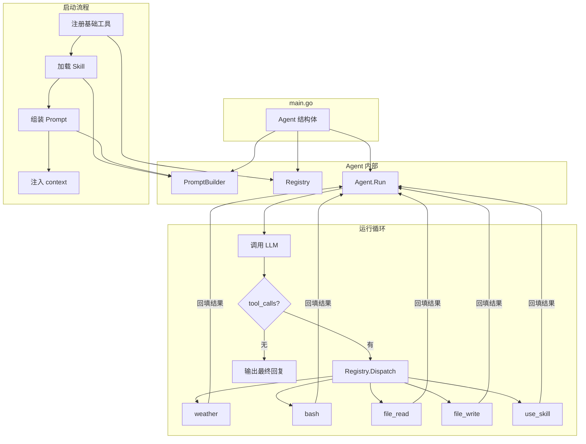

# 阶段总结：前四天的代码架构

## 我们走到了哪

四天前，你只有一个 `main.go`，里面写着硬编码的 `getWeather`。现在你的项目有 **7 个包、12 个文件、约 750 行 Go 代码**，具备了：

- 5 个可插拔的内置工具（weather / bash / file_read / file_write / use_skill）
- 1 个可扩展的 Skill 系统（目录即 Skill）
- 结构化的 System Prompt 生成器
- Agent 结构体封装——Registry + Builder + 主循环收拢为一个可复用的 `Agent` 类型
- `main.go` 从 200 行衰减到 90 行，退化为纯启动器

---

## 当前代码全景图

```
gull-herness-agent/
├── main.go                  # 启动器：创建 Agent 并启动（~90 行）
│
├── agent/                   # Agent 封装层（收拢主循环逻辑）
│   └── agent.go             #   Agent 结构体 + Options + Run()
│
├── tool/                    # 工具包：Tool 接口 + 注册表 + 5 个工具实现
│   ├── tool.go              #   Tool 接口、Registry 注册表
│   ├── weather.go           #   WeatherTool（getWeather）
│   ├── bash.go              #   BashTool
│   ├── file_read.go         #   FileReadTool（带行号标注）
│   ├── file_write.go        #   FileWriteTool（自动 mkdir）
│   └── use_skill.go         #   UseSkillTool
│
├── skill/                   # Skill 包：SKILL.md 解析 + 目录扫描
│   ├── skill.go             #   Skill 结构体、frontmatter 解析
│   └── loader.go            #   Loader 目录扫描
│
├── prompt/                  # Prompt 包：结构化 System Prompt 生成
│   ├── prompt.go            #   Builder（身份 + Skill + 准则 + 环境）
│   └── system.go            #   默认常量
│
└── skills/                  # Skill 仓库（目录即 Skill）
    └── code-review/
        └── SKILL.md
```

---

## 运行时架构图



---

## 四天演进对比

| Day | 核心产出 | 解决的问题 | 新增文件数 |
|-----|---------|-----------|:---:|
| **Day 1** | Agent Loop | 从"单次问答"到"多轮推理" | 1（main.go） |
| **Day 2** | Tool 接口 + Registry | 从 switch 硬编码到可插拔工具系统 | 5（tool/ 包） |
| **Day 3** | PromptBuilder | 从硬编码字符串到结构化动态 prompt | 2（prompt/ 包） |
| **Day 4** | Skill 机制 | 从通用助手到可按需加载的领域专家 | 3（skill/ 包 + SKILL.md） |
| **🧩 重构** | Agent 封装 | Builder + Registry + runAgentLoop → Agent 结构体 | 1（agent/ 包） |

---

## 各包职责一览

| 包 | 对外暴露 | 核心设计模式 |
|----|---------|-------------|
| `agent` | `Agent` 结构体、`New()`、`Run()`、Options | 函数式选项 + 状态容器 |
| `tool` | `Tool` 接口、`Registry`、5 个 `NewXxxTool()` | 面向接口注册 + 注册表查找 |
| `skill` | `Skill` 结构体、`Loader`、`Parse()` | 目录扫描 + 文件解析 |
| `prompt` | `Builder`、默认常量 | Builder 模式（链式调用） |
| `main` | — | 启动器（创建 Agent，一行 `agent.New(...).Run()`） |

---

## 关键设计决策回顾

### 为什么有 Tool 和 Skill 两层扩展体系？

Tool 和 Skill 解决的是不同维度的问题：

| | Tool | Skill |
|------|------|------|
| **定义** | 可执行的操作（bash、file_read） | 领域知识（代码审查指南、性能优化 checklist） |
| **触发方式** | 模型直接调用工具函数 | 模型调用 `use_skill` 获取知识，再指导后续行动 |
| **类比** | 手（能做事） | 脑（知道怎么做） |
| **扩展成本** | 写 Go 代码实现接口 | 创建目录 + 写 SKILL.md，零代码 |

如果合并成一层——所有东西都是 Tool——那么"代码审查指南"只能是一个返回文本字符串的工具。这没有错，但失去了"按需加载正文"的语义清晰性，也把"执行操作"和"注入知识"两种不同意图混在了一起。分开设计让拓展者一眼就知道该加什么。

### 为什么元数据常驻、正文按需？

不是技术限制，是**性价比决策**。

一个 Skill 的元数据（name + description）约 50 token，正文可能 300-800 token。如果正文常驻 System Prompt，10 个普通 Skill 就会吃掉 5000+ token——而大部分轮次根本用不到这些知识。

两阶段加载的收益：100 个 Skill 的元数据常驻 = ~5000 token，比 1 个 Skill 的正文常驻还省。问天气时只承担元数据开销，审查代码时才加载对应正文。这种"信息金字塔"模式是 Agent 可扩展性的关键——Skill 数量可以无限增长，但每轮 token 消耗保持稳定。

### 为什么收敛到 Agent 结构体，而不是保持函数式？

这不是 Go 的选择，是架构演进的选择——从"脚本"到"框架"。

散落的全局函数（`runAgentLoop`、`dispatchTool`）意味着 **Agent 和你的项目是一体的**——你想在一个进程里跑两个不同配置的 Agent（一个做代码审查、一个做天气查询），唯一的办法是复制粘贴主循环代码。

收敛为结构体后，Agent 变成了一个**可复用的组件**：

```go
// 创建两个不同配置的 Agent，互不干扰
codeReviewer := agent.New(client, agent.WithRegistry(crRegistry), agent.WithPrompt(crPrompt))
weatherBot   := agent.New(client, agent.WithRegistry(wRegistry),  agent.WithPrompt(wPrompt))
go codeReviewer.Run()
go weatherBot.Run()
```

这一步把 Agent 从"这个项目的 main 函数"升级为了"任意项目都可以引用并配置的模块"。

---

## Days 1-4 累计：你能做什么

以一个对话为例，展示当前 Agent 的综合能力：

```
用户: "把 main.go 里的 tokenThreshold 从 200000 改成 100000，然后审查改动是否正确"

=== iteration 1 ===
[tool] file_read -> main.go（179 行，带行号）
=== iteration 2 ===
[tool] file_write -> 已写入 main.go（修改完成）
=== iteration 3 ===
[tool] use_skill -> 代码审查指南（四个维度）
=== iteration 4 ===
[tool] file_read -> main.go（确认改动）
=== iteration 5 ===
模型未发起工具调用，结束 agent loop
改动正确：第 21 行 tokenThreshold 已从 200000 改为 100000，
且没有引入新的魔法数字。建议将 100000 也提取为常量。
```

这个对话用到了 **file_read + file_write（Day 2）+ use_skill（Day 4）+ Agent Loop 多轮推理（Day 1）**，Prompt 中还有"先读后改"准则（Day 3）在约束行为。

---

## 重构：Agent 封装

完成 Days 1-4 后，我们做了一次关键的架构重构——把散落在 `main.go` 的函数收敛为 `agent/` 包。

### 动机

`main.go` 承载了太多职责——`runAgentLoop`、`dispatchTool`、`handleError`、`logRequest`、`logResponse` 等函数都是全局的，复用性为零。想创建两个不同配置的 Agent（一个做代码审查、一个做天气查询），必须复制粘贴主循环代码。

### 方案

```go
// 创建并启动 Agent，一行搞定
ag := agent.New(client,
    agent.WithRegistry(registry),
    agent.WithPrompt(pb),
    agent.WithMessages([]openai.ChatCompletionMessageParamUnion{
        openai.UserMessage("北京今天天气怎么样？"),
    }),
    agent.WithMaxIterations(10),
    agent.WithTokenThreshold(200_000),
    agent.WithLogger(logger),
)
ag.Run()
```

### 效果

| 指标 | Before | After |
|------|--------|-------|
| main.go 行数 | ~200 行 | ~90 行 |
| 循环逻辑 | `runAgentLoop` 全局函数 | `Agent.Run()` 方法 |
| 工具分发 | `dispatchTool` 全局函数 | `agent.dispatch()` 私有方法 |
| 错误处理 | `handleError` 全局函数 | `agent.handleError()` 私有方法 |
| 配置方式 | 全局常量 `maxIterations` | Option 注入到 Agent 字段 |
| 复用 | 复制粘贴 main.go | 一行 `agent.New(...).Run()` |

`main.go` 从"编排者"退化为"启动器"——只负责创建 `Agent` 并调用 `agent.Run()`。这是从"写脚本"到"写框架"的关键一步。

---

## 下一步

Days 5-6 将给这个骨架装上真正的"肌肉"：

| Day | 主题 | 核心挑战 |
|-----|------|---------|
| Day 5 | MCP 客户端 | 让 Agent 通过标准协议调用外部服务 |
| Day 6 | 消息管理与对话压缩 | 解决"上下文超限"，支持超长对话 |

